# Design Document: Activity Tracker (Aktivitas Pelacakan)

## Overview

The Activity Tracker (Aktivitas Pelacakan) is a standalone monitoring module that provides Kepala SPPG with comprehensive real-time visibility into the complete lifecycle of menu orders from initiation through preparation, cooking, packing, delivery, ompreng collection, and cleaning. This module tracks 16 distinct stages with a vertical timeline interface showing status indicators, timestamps, descriptions, and optional media (photos/videos) for each stage.

### Key Design Decisions

1. **Standalone Module**: The Activity Tracker is implemented as a standalone module (not a sub-module of Dashboard or Logistics) with its own navigation entry, providing dedicated focus on order lifecycle monitoring.

2. **Vertical Timeline UI**: The interface uses a vertical timeline design similar to delivery tracking apps, with each stage displayed as a node connected by vertical lines, showing completion status, timestamps, and descriptions.

3. **Order-Centric View**: The module focuses on individual menu orders (not just deliveries), tracking the complete lifecycle from order initiation through final completion (16 stages).

4. **Existing Model Reuse**: The design leverages existing database models (`DeliveryRecord`, `StatusTransition`, `OmprengCleaning`) to minimize schema changes and maintain consistency with the current system architecture.

5. **Real-time Firebase Synchronization**: Status updates are synchronized to Firebase in real-time to provide immediate visibility without requiring page refreshes, following the established pattern used in KDS modules.

6. **Media Support**: Each stage can optionally include photos or videos for visual confirmation of progress (e.g., photo of cooked menu, video of packing process).

7. **Integration via Status Transitions**: The Activity Tracker integrates with KDS Cooking, Packing, Cleaning modules and Logistics operations through status transition events, maintaining loose coupling while ensuring data consistency.

## Architecture

### System Context

```
┌─────────────────────────────────────────────────────────────────┐
│                  Activity Tracker Module (Standalone)            │
│                      (Aktivitas Pelacakan)                       │
│  ┌───────────────────────────────────────────────────────────┐  │
│  │              Order List View                              │  │
│  │  - Date filter                                            │  │
│  │  - School filter                                          │  │
│  │  - Order cards with status                                │  │
│  └───────────────────────────────────────────────────────────┘  │
│  ┌───────────────────────────────────────────────────────────┐  │
│  │         Order Detail View (Vertical Timeline)             │  │
│  │  - Order header with photo                                │  │
│  │  - 16-stage vertical timeline                             │  │
│  │  - Status indicators and timestamps                       │  │
│  │  - Media support (photos/videos)                          │  │
│  │  - Real-time status updates                               │  │
│  └───────────────────────────────────────────────────────────┘  │
└─────────────────────────────────────────────────────────────────┘
                              │
                              │ Integrates with
                              ▼
┌─────────────────────────────────────────────────────────────────┐
│                      KDS Modules (Existing)                      │
│  ┌──────────────┐  ┌──────────────┐  ┌──────────────┐          │
│  │   Cooking    │  │   Packing    │  │  Cleaning    │          │
│  │   Module     │  │   Module     │  │   Module     │          │
│  └──────────────┘  └──────────────┘  └──────────────┘          │
└─────────────────────────────────────────────────────────────────┘
                              │
                              │ Status Updates
                              ▼
┌─────────────────────────────────────────────────────────────────┐
│                    Firebase Realtime Database                    │
│  - order_tracking/{date}/{order_id}                             │
│  - status_transitions/{date}/{order_id}                         │
└─────────────────────────────────────────────────────────────────┘
                              │
                              │ Integrates with
                              ▼
┌─────────────────────────────────────────────────────────────────┐
│                  Logistics/Delivery Module                       │
│  - Driver assignment                                            │
│  - Delivery tracking                                            │
│  - Ompreng collection                                           │
└─────────────────────────────────────────────────────────────────┘
```

### Component Architecture

```
┌─────────────────────────────────────────────────────────────────┐
│                         Frontend (Vue 3)                         │
│  ┌───────────────────────────────────────────────────────────┐  │
│  │  ActivityTrackerListView.vue                              │  │
│  │  - Date filter                                            │  │
│  │  - School filter                                          │  │
│  │  - Search box                                             │  │
│  │  - Order cards grid                                       │  │
│  │  - Status summary                                         │  │
│  │  - Real-time Firebase listener                            │  │
│  └───────────────────────────────────────────────────────────┘  │
│  ┌───────────────────────────────────────────────────────────┐  │
│  │  ActivityTrackerDetailView.vue                            │  │
│  │  - Order header (photo, name, school, portions)           │  │
│  │  - Vertical timeline component                            │  │
│  │  - Back button to list                                    │  │
│  │  - Real-time Firebase listener                            │  │
│  └───────────────────────────────────────────────────────────┘  │
│  ┌──────────────────────┐  ┌──────────────────────────────┐    │
│  │ VerticalTimeline.vue │  │ TimelineStage.vue            │    │
│  │ - 16 stage nodes     │  │ - Stage indicator (circle)   │    │
│  │ - Connecting lines   │  │ - Stage title & description  │    │
│  │ - Status indicators  │  │ - Timestamp display          │    │
│  │                      │  │ - Photo/video thumbnail      │    │
│  │                      │  │ - Media viewer modal         │    │
│  └──────────────────────┘  └──────────────────────────────┘    │
└─────────────────────────────────────────────────────────────────┘
                              │
                              │ HTTP + WebSocket
                              ▼
┌─────────────────────────────────────────────────────────────────┐
│                      Backend (Go/Gin)                            │
│  ┌───────────────────────────────────────────────────────────┐  │
│  │  ActivityTrackerHandler                                   │  │
│  │  - GET /api/activity-tracker/orders                       │  │
│  │  - GET /api/activity-tracker/orders/:id                   │  │
│  │  - PUT /api/activity-tracker/orders/:id/status            │  │
│  │  - POST /api/activity-tracker/orders/:id/media            │  │
│  └───────────────────────────────────────────────────────────┘  │
│  ┌───────────────────────────────────────────────────────────┐  │
│  │  ActivityTrackerService                                   │  │
│  │  - GetOrdersByDate()                                      │  │
│  │  - GetOrderDetails()                                      │  │
│  │  - UpdateOrderStatus()                                    │  │
│  │  - AttachMedia()                                          │  │
│  │  - SyncToFirebase()                                       │  │
│  │  - HandleKDSStatusUpdate()                                │  │
│  │  - HandleLogisticsStatusUpdate()                          │  │
│  └───────────────────────────────────────────────────────────┘  │
└─────────────────────────────────────────────────────────────────┘
                              │
                              │ GORM
                              ▼
┌─────────────────────────────────────────────────────────────────┐
│                      PostgreSQL Database                         │
│  - delivery_records (reused as order records)                   │
│  - status_transitions                                           │
│  - ompreng_cleanings                                            │
│  - stage_media (new table for photos/videos)                    │
│  - schools                                                      │
│  - users (drivers)                                              │
└─────────────────────────────────────────────────────────────────┘
```

## Components and Interfaces

### Backend Components

#### 1. ActivityTrackerHandler

HTTP handler for Activity Tracker API endpoints.

```go
type ActivityTrackerHandler struct {
    service *ActivityTrackerService
}

// GetOrdersByDate retrieves all orders for a specific date
// GET /api/activity-tracker/orders?date=2024-01-15&school_id=5
func (h *ActivityTrackerHandler) GetOrdersByDate(c *gin.Context)

// GetOrderDetails retrieves detailed information for a specific order
// GET /api/activity-tracker/orders/:id
func (h *ActivityTrackerHandler) GetOrderDetails(c *gin.Context)

// UpdateOrderStatus manually updates order status (Kepala SPPG correction)
// PUT /api/activity-tracker/orders/:id/status
func (h *ActivityTrackerHandler) UpdateOrderStatus(c *gin.Context)

// AttachStageMedia attaches photo or video to a specific stage
// POST /api/activity-tracker/orders/:id/stages/:stage/media
func (h *ActivityTrackerHandler) AttachStageMedia(c *gin.Context)
```

#### 2. ActivityTrackerService

Business logic for activity tracking operations.

```go
type ActivityTrackerService struct {
    db          *gorm.DB
    firebaseApp *firebase.App
    dbClient    *db.Client
}

// GetOrdersByDate retrieves all order records for a specific date with optional school filter
func (s *ActivityTrackerService) GetOrdersByDate(ctx context.Context, date time.Time, schoolID *uint) ([]OrderResponse, error)

// GetOrderDetails retrieves detailed information including vertical timeline data
func (s *ActivityTrackerService) GetOrderDetails(ctx context.Context, orderID uint) (*OrderDetailResponse, error)

// UpdateOrderStatus updates order status and creates status transition
func (s *ActivityTrackerService) UpdateOrderStatus(ctx context.Context, orderID uint, newStatus string, userID uint, notes string) error

// AttachStageMedia attaches photo or video URL to a specific stage transition
func (s *ActivityTrackerService) AttachStageMedia(ctx context.Context, orderID uint, stage int, mediaURL string, mediaType string) error

// SyncOrderToFirebase synchronizes order record to Firebase
func (s *ActivityTrackerService) SyncOrderToFirebase(ctx context.Context, orderID uint) error

// HandleKDSStatusUpdate processes status updates from KDS modules
func (s *ActivityTrackerService) HandleKDSStatusUpdate(ctx context.Context, orderID uint, kdsStatus string, userID uint) error

// HandleLogisticsStatusUpdate processes status updates from Logistics/Delivery module
func (s *ActivityTrackerService) HandleLogisticsStatusUpdate(ctx context.Context, orderID uint, logisticsStatus string, userID uint) error
```

### Frontend Components

#### 1. ActivityTrackerListView.vue

Main list view component showing all orders for selected date.

**Props**: None (route-based)

**Data**:
- `selectedDate`: Date - Currently selected date for filtering
- `selectedSchoolId`: Number - Selected school ID for filtering (optional)
- `searchQuery`: String - Search text for menu/school name
- `orders`: Array - List of order records
- `loading`: Boolean - Loading state
- `statusSummary`: Object - Status distribution counts

**Methods**:
- `fetchOrders()`: Fetch orders for selected date and filters
- `navigateToDetail(orderId)`: Navigate to order detail view
- `setupFirebaseListener()`: Initialize real-time updates
- `handleStatusUpdate(order)`: Process Firebase status change
- `filterOrders()`: Apply search and school filters

#### 2. ActivityTrackerDetailView.vue

Detail view component showing vertical timeline for a specific order.

**Props**: None (route-based, uses route params for order ID)

**Data**:
- `order`: Object - Order details
- `timeline`: Array - All 16 stages with status and timestamps
- `loading`: Boolean - Loading state

**Methods**:
- `fetchOrderDetails()`: Fetch order details and timeline
- `goBack()`: Navigate back to list view
- `setupFirebaseListener()`: Initialize real-time updates
- `handleStatusUpdate(order)`: Process Firebase status change

#### 3. VerticalTimeline.vue

Vertical timeline visualization component showing all 16 stages.

**Props**:
- `orderId`: Number - Order record ID
- `currentStage`: Number - Current stage number (1-16)
- `timeline`: Array - Timeline data with status, timestamps, media

**Computed**:
- `stages`: Array - All 16 stages with metadata
- `completedStages`: Array - List of completed stages
- `currentStageData`: Object - Current stage information

**Methods**:
- `getStageStatus(stageNumber)`: Get status (completed/in-progress/pending)
- `formatTimeRange(startTime, endTime)`: Format to "Rabu, 13:49 - Rabu, 13:50"
- `hasMedia(stage)`: Check if stage has photo or video

#### 4. TimelineStage.vue

Individual stage component in the vertical timeline.

**Props**:
- `stage`: Object - Stage data (number, title, description, status, timestamp, media)
- `isCompleted`: Boolean - Whether stage is completed
- `isInProgress`: Boolean - Whether stage is in progress
- `isLast`: Boolean - Whether this is the last stage

**Data**:
- `showMediaModal`: Boolean - Media viewer modal visibility

**Methods**:
- `openMedia()`: Open photo/video in modal
- `getIndicatorClass()`: Get CSS class for status indicator
- `getConnectorClass()`: Get CSS class for connecting line

### API Endpoints

#### GET /api/activity-tracker/orders

Retrieve all orders for a specific date with optional filters.

**Query Parameters**:
- `date`: string (YYYY-MM-DD format, required)
- `school_id`: integer (optional, filter by school)
- `search`: string (optional, search by menu name or school name)

**Response**:
```json
{
  "success": true,
  "data": {
    "orders": [
      {
        "id": 1,
        "order_date": "2024-01-15T00:00:00Z",
        "school": {
          "id": 5,
          "name": "SD Negeri 1 Jakarta",
          "address": "Jl. Pendidikan No. 123"
        },
        "menu": {
          "id": 20,
          "name": "Nasi Goreng Ayam",
          "photo_url": "https://storage.../nasi-goreng.jpg"
        },
        "driver": {
          "id": 10,
          "name": "Budi Santoso",
          "vehicle_info": "B 1234 XYZ - Toyota Avanza"
        },
        "portions": 150,
        "current_status": "pesanan_sudah_diterima",
        "current_stage": 7,
        "ompreng_count": 15,
        "updated_at": "2024-01-15T10:30:00Z"
      }
    ],
    "total_count": 12,
    "summary": {
      "total_orders": 12,
      "status_distribution": {
        "order_dimasak": 1,
        "pesanan_dalam_perjalanan": 2,
        "pesanan_sudah_diterima": 5,
        "ompreng_selesai_dicuci": 4
      }
    }
  }
}
```
          "address": "Jl. Pendidikan No. 123",
          "phone_number": "021-12345678"
        },
        "driver": {
          "id": 10,
          "name": "Budi Santoso",
          "phone_number": "081234567890",
          "vehicle_info": "B 1234 XYZ - Toyota Avanza"
        },
        "portions": 150,
        "current_status": "sudah_diterima_pihak_sekolah",
        "ompreng_count": 15,
        "updated_at": "2024-01-15T10:30:00Z"
      }
    ],
    "total_count": 12,
    "summary": {
      "total_deliveries": 12,
      "completed_deliveries": 8,
      "in_progress": 4,
      "status_counts": {
        "sedang_dimasak": 1,
        "diperjalanan": 2,
        "sudah_diterima_pihak_sekolah": 5,
        "ompreng_selesai_dicuci": 4
      }
    }
  }
}
```

#### GET /api/activity-tracker/orders/:id

Retrieve detailed information for a specific order including vertical timeline data.

**Path Parameters**:
- `id`: integer (order record ID)

**Response**:
```json
{
  "success": true,
  "data": {
    "id": 1,
    "order_date": "2024-01-15T00:00:00Z",
    "school": {
      "id": 5,
      "name": "SD Negeri 1 Jakarta",
      "address": "Jl. Pendidikan No. 123",
      "contact_person": "Ibu Siti",
      "phone_number": "021-12345678"
    },
    "driver": {
      "id": 10,
      "name": "Budi Santoso",
      "phone_number": "081234567890",
      "vehicle_info": "B 1234 XYZ - Toyota Avanza"
    },
    "menu": {
      "id": 20,
      "name": "Nasi Goreng Ayam",
      "photo_url": "https://storage.../nasi-goreng.jpg",
      "category": "main_course"
    },
    "portions": 150,
    "current_status": "pesanan_sudah_diterima",
    "current_stage": 7,
    "ompreng_count": 15,
    "timeline": [
      {
        "stage": 1,
        "status": "order_disiapkan",
        "title": "Order sedang disiapkan",
        "description": "Makanan sedang diproses dan disiapkan untuk dimasak.",
        "is_completed": true,
        "started_at": "2024-01-15T05:00:00Z",
        "completed_at": "2024-01-15T05:30:00Z",
        "transitioned_by": {
          "id": 2,
          "name": "Admin SPPG"
        },
        "media": null
      },
      {
        "stage": 2,
        "status": "order_dimasak",
        "title": "Order sedang dimasak",
        "description": "Makanan sedang dimasak sesuai menu yang dijadwalkan.",
        "is_completed": true,
        "started_at": "2024-01-15T05:30:00Z",
        "completed_at": "2024-01-15T06:30:00Z",
        "transitioned_by": {
          "id": 3,
          "name": "Chef Andi"
        },
        "media": {
          "type": "photo",
          "url": "https://storage.../cooking-photo.jpg",
          "thumbnail_url": "https://storage.../cooking-thumb.jpg"
        }
      },
      {
        "stage": 7,
        "status": "pesanan_sudah_diterima",
        "title": "Pesanan sudah diterima",
        "description": "Pesanan sudah diterima pihak sekolah.",
        "is_completed": true,
        "started_at": "2024-01-15T10:00:00Z",
        "completed_at": "2024-01-15T10:30:00Z",
        "transitioned_by": {
          "id": 15,
          "name": "Ibu Siti (Sekolah)"
        },
        "media": {
          "type": "video",
          "url": "https://storage.../delivery-video.mp4",
          "thumbnail_url": "https://storage.../delivery-thumb.jpg"
        }
      },
      {
        "stage": 8,
        "status": "driver_menuju_lokasi",
        "title": "Driver menuju lokasi pengambilan",
        "description": "Driver diperjalanan mengambil menu/ompreng/wadah makan.",
        "is_completed": false,
        "started_at": null,
        "completed_at": null,
        "transitioned_by": null,
        "media": null
      }
    ],
    "created_at": "2024-01-15T05:00:00Z",
    "updated_at": "2024-01-15T10:30:00Z"
  }
}
```

#### PUT /api/activity-tracker/orders/:id/status

Manually update order status (for corrections by Kepala SPPG).

**Path Parameters**:
- `id`: integer (order record ID)

**Request Body**:
```json
{
  "new_status": "pesanan_dalam_perjalanan",
  "stage": 5,
  "notes": "Manual correction by Kepala SPPG"
}
```

**Response**:
```json
{
  "success": true,
  "message": "Status updated successfully",
  "data": {
    "id": 1,
    "current_status": "pesanan_dalam_perjalanan",
    "current_stage": 5,
    "updated_at": "2024-01-15T11:00:00Z"
  }
}
```

#### POST /api/activity-tracker/orders/:id/stages/:stage/media

Attach photo or video to a specific stage.

**Path Parameters**:
- `id`: integer (order record ID)
- `stage`: integer (stage number 1-16)

**Request Body** (multipart/form-data):
```
media: file (image or video)
media_type: string ("photo" or "video")
```

**Response**:
```json
{
  "success": true,
  "message": "Media attached successfully",
  "data": {
    "media_url": "https://storage.../media-file.jpg",
    "thumbnail_url": "https://storage.../media-thumb.jpg",
    "media_type": "photo"
  }
}
```
  "success": true,
  "message": "Status updated successfully",
  "data": {
    "id": 1,
    "current_status": "diperjalanan",
    "updated_at": "2024-01-15T11:00:00Z"
  }
}
```

## Data Models

### Existing Models (Reused)

The Activity Tracker leverages existing database models from the logistics module with minor enhancements:

#### DeliveryRecord (Enhanced)

```go
type DeliveryRecord struct {
    ID            uint      `gorm:"primaryKey" json:"id"`
    DeliveryDate  time.Time `gorm:"index;not null" json:"delivery_date"`
    SchoolID      uint      `gorm:"index;not null" json:"school_id"`
    DriverID      uint      `gorm:"index;not null" json:"driver_id"`
    MenuItemID    uint      `gorm:"index;not null" json:"menu_item_id"`
    Portions      int       `gorm:"not null" json:"portions"`
    CurrentStatus string    `gorm:"size:50;not null;index" json:"current_status"`
    CurrentStage  int       `gorm:"not null;default:1" json:"current_stage"` // NEW: Stage number 1-16
    OmprengCount  int       `gorm:"not null" json:"ompreng_count"`
    CreatedAt     time.Time `json:"created_at"`
    UpdatedAt     time.Time `json:"updated_at"`
    School        School    `gorm:"foreignKey:SchoolID" json:"school,omitempty"`
    Driver        User      `gorm:"foreignKey:DriverID" json:"driver,omitempty"`
    MenuItem      MenuItem  `gorm:"foreignKey:MenuItemID" json:"menu_item,omitempty"`
}
```

#### StatusTransition (Enhanced)

```go
type StatusTransition struct {
    ID               uint           `gorm:"primaryKey" json:"id"`
    DeliveryRecordID uint           `gorm:"index;not null" json:"delivery_record_id"`
    FromStatus       string         `gorm:"size:50" json:"from_status"`
    ToStatus         string         `gorm:"size:50;not null" json:"to_status"`
    Stage            int            `gorm:"not null" json:"stage"` // NEW: Stage number 1-16
    TransitionedAt   time.Time      `gorm:"index;not null" json:"transitioned_at"`
    TransitionedBy   uint           `gorm:"index;not null" json:"transitioned_by"`
    Notes            string         `gorm:"type:text" json:"notes"`
    MediaURL         string         `gorm:"size:500" json:"media_url"` // NEW: Photo/video URL
    MediaType        string         `gorm:"size:20" json:"media_type"` // NEW: "photo" or "video"
    DeliveryRecord   DeliveryRecord `gorm:"foreignKey:DeliveryRecordID" json:"delivery_record,omitempty"`
    User             User           `gorm:"foreignKey:TransitionedBy" json:"user,omitempty"`
}
```

#### OmprengCleaning

```go
type OmprengCleaning struct {
    ID               uint           `gorm:"primaryKey" json:"id"`
    DeliveryRecordID uint           `gorm:"index;not null" json:"delivery_record_id"`
    OmprengCount     int            `gorm:"not null" json:"ompreng_count"`
    CleaningStatus   string         `gorm:"size:30;not null" json:"cleaning_status"`
    StartedAt        *time.Time     `json:"started_at"`
    CompletedAt      *time.Time     `json:"completed_at"`
    CleanedBy        *uint          `gorm:"index" json:"cleaned_by"`
    CreatedAt        time.Time      `json:"created_at"`
    UpdatedAt        time.Time      `json:"updated_at"`
    DeliveryRecord   DeliveryRecord `gorm:"foreignKey:DeliveryRecordID" json:"delivery_record,omitempty"`
    Cleaner          User           `gorm:"foreignKey:CleanedBy" json:"cleaner,omitempty"`
}
```

### 16-Stage Status Flow

The `CurrentStatus` field in `DeliveryRecord` tracks the current stage using these values:

#### Order Initiation and Preparation Stages (1-4)

1. `order_disiapkan` - Order being prepared (Order sedang disiapkan) - Menu order initiated and being prepared
2. `order_dimasak` - Order being cooked (Order sedang dimasak) - Menu actively being cooked
3. `order_dikemas` - Order being packed (Order sedang dikemas) - Menu cooking completed and being packed
4. `order_siap_diambil` - Order ready for pickup (Order siap diambil) - Menu packing completed and ready for delivery

#### Delivery Transit Stages (5-7)

5. `pesanan_dalam_perjalanan` - Order in transit (Pesanan dalam perjalanan) - Driver departed with menu to school
6. `pesanan_sudah_tiba` - Order arrived (Pesanan sudah tiba) - Driver arrived at school with menu
7. `pesanan_sudah_diterima` - Order received (Pesanan sudah diterima) - Menu received and confirmed by school

#### Ompreng Collection Stages (8-11)

8. `driver_menuju_lokasi` - Driver heading to pickup location (Driver menuju lokasi pengambilan) - Driver assigned and traveling to school
9. `driver_tiba_di_lokasi` - Driver arrived at location (Driver sudah tiba di lokasi) - Driver arrived at school for ompreng collection
10. `driver_kembali` - Driver returning (Driver dalam perjalanan kembali) - Driver in transit back to SPPG with ompreng
11. `driver_tiba_di_sppg` - Driver arrived at SPPG (Driver sudah tiba di SPPG) - Driver returned to SPPG with ompreng

#### Ompreng Cleaning and Completion Stages (12-16)

12. `ompreng_siap_dicuci` - Ompreng ready for cleaning (Ompreng siap dicuci) - Ompreng received and queued for cleaning
13. `ompreng_sedang_dicuci` - Ompreng being cleaned (Ompreng sedang dicuci) - Cleaning in progress
14. `ompreng_selesai_dicuci` - Ompreng cleaning completed (Ompreng selesai dicuci) - Cleaning completed
15. `ompreng_siap_digunakan` - Ompreng ready for reuse (Ompreng siap digunakan kembali) - Containers sanitized and stored
16. `order_selesai` - Order completed (Order selesai) - Complete order lifecycle finished

### Status Transition Mapping

#### KDS Cooking Module → Activity Tracker

| KDS Cooking Status | Activity Tracker Status | Stage |
|-------------------|------------------------|-------|
| `cooking` | `order_dimasak` | 2 |
| `ready` | `order_dikemas` | 3 |
| `packing_completed` | `order_siap_diambil` | 4 |

#### Logistics/Delivery Module → Activity Tracker

| Logistics Status | Activity Tracker Status | Stage |
|-----------------|------------------------|-------|
| `driver_departed` | `pesanan_dalam_perjalanan` | 5 |
| `driver_arrived` | `pesanan_sudah_tiba` | 6 |
| `delivery_confirmed` | `pesanan_sudah_diterima` | 7 |
| `collection_assigned` | `driver_menuju_lokasi` | 8 |
| `collection_arrived` | `driver_tiba_di_lokasi` | 9 |
| `collection_departed` | `driver_kembali` | 10 |
| `collection_completed` | `driver_tiba_di_sppg` | 11 |

#### KDS Cleaning Module → Activity Tracker

| KDS Cleaning Status | Activity Tracker Status | Stage |
|---------------------|------------------------|-------|
| `ready_for_cleaning` | `ompreng_siap_dicuci` | 12 |
| `cleaning` | `ompreng_sedang_dicuci` | 13 |
| `cleaning_completed` | `ompreng_selesai_dicuci` | 14 |
| `ready_for_reuse` | `ompreng_siap_digunakan` | 15 |
| `order_completed` | `order_selesai` | 16 |

### Firebase Data Structure

```
order_tracking/
  {date}/                          // e.g., "2024-01-15"
    {order_id}/
      id: 1
      order_date: "2024-01-15T00:00:00Z"
      school_id: 5
      school_name: "SD Negeri 1 Jakarta"
      driver_id: 10
      driver_name: "Budi Santoso"
      menu_name: "Nasi Goreng Ayam"
      menu_photo_url: "https://..."
      portions: 150
      current_status: "pesanan_sudah_diterima"
      current_stage: 7
      ompreng_count: 15
      updated_at: "2024-01-15T10:30:00Z"
      
status_transitions/
  {date}/
    {order_id}/
      transitions: [
        {
          id: 1
          from_status: ""
          to_status: "order_disiapkan"
          stage: 1
          transitioned_at: "2024-01-15T05:00:00Z"
          transitioned_by_name: "Admin SPPG"
          notes: "Order initiated"
          media_url: null
        },
        {
          id: 2
          from_status: "order_disiapkan"
          to_status: "order_dimasak"
          stage: 2
          transitioned_at: "2024-01-15T06:00:00Z"
          transitioned_by_name: "Chef Andi"
          notes: "Cooking started"
          media_url: "https://.../cooking-photo.jpg"
        }
      ]
```

## 16-Stage Status Flow Diagram

```mermaid
graph TD
    A[1. order_disiapkan<br/>Order sedang disiapkan] --> B[2. order_dimasak<br/>Order sedang dimasak]
    B --> C[3. order_dikemas<br/>Order sedang dikemas]
    C --> D[4. order_siap_diambil<br/>Order siap diambil]
    D --> E[5. pesanan_dalam_perjalanan<br/>Pesanan dalam perjalanan]
    E --> F[6. pesanan_sudah_tiba<br/>Pesanan sudah tiba]
    F --> G[7. pesanan_sudah_diterima<br/>Pesanan sudah diterima]
    G --> H[8. driver_menuju_lokasi<br/>Driver menuju lokasi pengambilan]
    H --> I[9. driver_tiba_di_lokasi<br/>Driver sudah tiba di lokasi]
    I --> J[10. driver_kembali<br/>Driver dalam perjalanan kembali]
    J --> K[11. driver_tiba_di_sppg<br/>Driver sudah tiba di SPPG]
    K --> L[12. ompreng_siap_dicuci<br/>Ompreng siap dicuci]
    L --> M[13. ompreng_sedang_dicuci<br/>Ompreng sedang dicuci]
    M --> N[14. ompreng_selesai_dicuci<br/>Ompreng selesai dicuci]
    N --> O[15. ompreng_siap_digunakan<br/>Ompreng siap digunakan kembali]
    O --> P[16. order_selesai<br/>Order selesai]
    
    style A fill:#f9f9f9
    style B fill:#fff3cd
    style C fill:#fff3cd
    style D fill:#d4edda
    style E fill:#fff3cd
    style F fill:#d4edda
    style G fill:#d4edda
    style H fill:#fff3cd
    style I fill:#d4edda
    style J fill:#fff3cd
    style K fill:#d4edda
    style L fill:#f9f9f9
    style M fill:#fff3cd
    style N fill:#d4edda
    style O fill:#d4edda
    style P fill:#28a745
```



### Stage Categories

**Initiation & Preparation Phase (Stages 1-4)**
- Managed by KDS Cooking and Packing modules
- Transitions triggered automatically by kitchen staff actions
- Focus: Order initiation and menu readiness for delivery

**Delivery Phase (Stages 5-7)**
- Managed by driver mobile app or logistics staff
- Transitions based on GPS location and manual confirmation
- Focus: Menu delivery to schools

**Collection Phase (Stages 8-11)**
- Managed by driver mobile app or logistics staff
- Transitions based on ompreng pickup and return
- Focus: Container retrieval from schools

**Cleaning & Completion Phase (Stages 12-16)**
- Managed by KDS Cleaning module
- Transitions triggered by cleaning staff actions
- Focus: Container hygiene, readiness for reuse, and order completion


## Correctness Properties

*A property is a characteristic or behavior that should hold true across all valid executions of a system—essentially, a formal statement about what the system should do. Properties serve as the bridge between human-readable specifications and machine-verifiable correctness guarantees.*

### Property 1: Sequential Stage Display

*For any* delivery record, the timeline visualization should display all 16 stages in the defined sequential order from stage 1 (belum_dimasak) through stage 16 (ompreng_selesai_dicuci).

**Validates: Requirements 1.1**

### Property 2: Status Indicator Correctness

*For any* delivery record and any stage, the status indicator should be:
- Completed (green) if the stage index is less than the current status index
- In-progress (blue) if the stage matches the current status
- Pending (gray) if the stage index is greater than the current status index

**Validates: Requirements 1.2, 1.3, 1.4**

### Property 3: Indonesian Stage Labels

*For any* stage in the system, the displayed stage name should be in Indonesian language and match one of the 16 defined Indonesian labels (e.g., "Menu belum dimasak", "Menu sedang dimasak", etc.).

**Validates: Requirements 1.5**

### Property 4: Stage Transition Recording

*For any* valid status transition from one stage to another, the system should create a StatusTransition record with the correct from_status, to_status, timestamp, and user information.

**Validates: Requirements 2.1, 2.2, 2.3, 2.4, 2.5, 2.6, 3.1, 3.2, 3.3, 4.1, 4.2, 4.3, 4.4, 5.1, 5.2, 5.3**

### Property 5: Activity Log Presence

*For any* delivery record, querying for its activity log should return a non-empty list of status transitions.

**Validates: Requirements 6.1**

### Property 6: Transition Recording with Timestamp

*For any* status transition that occurs, the activity log should contain an entry for that transition with a non-null timestamp.

**Validates: Requirements 6.2**

### Property 7: Chronological Activity Log Ordering

*For any* activity log, the entries should be sorted in chronological order by transitioned_at timestamp in ascending order (earliest first).

**Validates: Requirements 6.3**

### Property 8: Activity Log Entry Completeness

*For any* activity log entry, it should contain both a non-empty to_status field and a valid transitioned_at timestamp.

**Validates: Requirements 6.4**

### Property 9: Local Timezone Formatting

*For any* timestamp displayed in the UI, it should be formatted in Asia/Jakarta timezone (WIB) with the format "DD MMM YYYY, HH:mm WIB".

**Validates: Requirements 6.5**

### Property 10: Delivery Response Completeness

*For any* delivery record returned by the API, the response should contain all required fields: school information (name, address, contact), driver information (name, vehicle, contact), and portions (greater than zero).

**Validates: Requirements 7.1, 7.2, 7.3, 7.4, 8.1, 8.2, 8.3**

### Property 11: Date Filter Accuracy

*For any* date selected in the date filter, all returned deliveries should have a delivery_date that matches the selected date (normalized to start of day).

**Validates: Requirements 9.2**

### Property 12: Date Range Acceptance

*For any* valid date (past, present, or future), the system should accept the date filter and return deliveries for that date without error.

**Validates: Requirements 9.4**

### Property 13: KDS Status Mapping Correctness

*For any* KDS module status update (cooking, packing, or cleaning), the Activity Tracker should transition to the corresponding mapped status according to the defined status mapping table.

**Validates: Requirements 11.1, 11.2, 11.3, 12.1, 12.2, 13.1, 13.2, 13.3**

### Property 14: Role-Based Access Control

*For any* user attempting to access the Activity Tracker, access should be granted if and only if the user has either Kepala_SPPG role or management role permissions; otherwise, access should be denied with an authorization error.

**Validates: Requirements 14.1, 14.2, 14.3**

### Property 15: Complete Delivery Retrieval

*For any* date, the GetDeliveriesByDate endpoint should return all delivery records that have a delivery_date matching that date, with no records omitted.

**Validates: Requirements 15.1**

### Property 16: Individual Timeline Instances

*For any* set of deliveries displayed, each delivery should have its own separate timeline component instance with its own activity log.

**Validates: Requirements 15.2**

### Property 17: Summary Count Accuracy

*For any* date, the summary count of total deliveries should equal the actual number of delivery records returned for that date.

**Validates: Requirements 15.4**

### Property 18: Sequential Transition Validation

*For any* delivery record, the sequence of status transitions should follow the defined 16-stage order, where each transition moves to a stage with an index greater than or equal to the previous stage index.

**Validates: Requirements 16.1**

### Property 19: Stage Skip Warning

*For any* status transition that skips one or more stages (e.g., transitioning from stage 2 directly to stage 5), the system should log a validation warning indicating the skipped stages.

**Validates: Requirements 16.2**

### Property 20: Manual Correction Audit Trail

*For any* manual status correction made by Kepala_SPPG, the activity log should contain a status transition record with notes indicating it was a manual correction and the user who made the correction.

**Validates: Requirements 16.4**

## Error Handling

### Backend Error Scenarios

#### 1. Database Connection Errors

**Scenario**: PostgreSQL database is unavailable or connection pool is exhausted.

**Handling**:
- Return HTTP 503 Service Unavailable
- Log error with connection details (excluding credentials)
- Implement exponential backoff for reconnection attempts
- Display user-friendly error message: "Service temporarily unavailable. Please try again in a moment."

#### 2. Firebase Synchronization Errors

**Scenario**: Firebase Realtime Database is unreachable or write operation fails.

**Handling**:
- Log error with Firebase operation details
- Continue serving data from PostgreSQL (Firebase is secondary)
- Implement retry queue for failed Firebase writes
- Do not block user operations due to Firebase failures
- Display warning to user: "Real-time updates may be delayed."

#### 3. Invalid Date Format

**Scenario**: User provides date in incorrect format or invalid date value.

**Handling**:
- Return HTTP 400 Bad Request
- Response body: `{"success": false, "error": "Invalid date format. Expected YYYY-MM-DD."}`
- Frontend validation should prevent this scenario

#### 4. Delivery Record Not Found

**Scenario**: User requests delivery details for non-existent delivery ID.

**Handling**:
- Return HTTP 404 Not Found
- Response body: `{"success": false, "error": "Delivery record not found."}`
- Log warning with requested ID for monitoring

#### 5. Invalid Status Transition

**Scenario**: Attempt to transition to an invalid status or skip multiple stages without authorization.

**Handling**:
- Return HTTP 400 Bad Request
- Response body: `{"success": false, "error": "Invalid status transition from {from_status} to {to_status}."}`
- Log validation warning with delivery ID and attempted transition
- Allow Kepala_SPPG to override with explicit confirmation

#### 6. Unauthorized Access

**Scenario**: User without proper role attempts to access Activity Tracker.

**Handling**:
- Return HTTP 403 Forbidden
- Response body: `{"success": false, "error": "You do not have permission to access this resource."}`
- Log unauthorized access attempt with user ID and IP address
- Redirect to login page if session expired

#### 7. Concurrent Status Updates

**Scenario**: Multiple users or systems attempt to update the same delivery status simultaneously.

**Handling**:
- Use database transactions with row-level locking
- Implement optimistic locking with version field
- Return HTTP 409 Conflict if concurrent update detected
- Response body: `{"success": false, "error": "This delivery was updated by another user. Please refresh and try again."}`

### Frontend Error Scenarios

#### 1. Network Request Failure

**Scenario**: API request fails due to network issues or timeout.

**Handling**:
- Display toast notification: "Network error. Please check your connection."
- Implement automatic retry with exponential backoff (max 3 attempts)
- Show loading state during retry attempts
- Provide manual refresh button

#### 2. Firebase Connection Loss

**Scenario**: WebSocket connection to Firebase is lost.

**Handling**:
- Display banner notification: "Real-time updates paused. Reconnecting..."
- Attempt automatic reconnection every 5 seconds
- Fall back to polling API every 30 seconds if Firebase unavailable
- Remove banner when connection restored

#### 3. Invalid Date Selection

**Scenario**: User attempts to select invalid date or date far in the future.

**Handling**:
- Disable invalid dates in date picker
- Show validation message: "Please select a valid date."
- Prevent form submission until valid date selected

#### 4. Empty Delivery List

**Scenario**: No deliveries exist for selected date.

**Handling**:
- Display empty state message: "No deliveries found for {date}."
- Show illustration or icon
- Provide suggestion: "Try selecting a different date."

#### 5. Timeline Rendering Error

**Scenario**: Delivery data is malformed or missing required fields.

**Handling**:
- Log error to console with delivery ID
- Display error state in timeline: "Unable to display timeline. Data may be incomplete."
- Continue rendering other deliveries
- Report error to monitoring service

## Testing Strategy

### Dual Testing Approach

The Activity Tracker will employ both unit testing and property-based testing to ensure comprehensive coverage:

- **Unit tests**: Verify specific examples, edge cases, error conditions, and integration points
- **Property tests**: Verify universal properties across all inputs through randomization

Both testing approaches are complementary and necessary. Unit tests catch concrete bugs in specific scenarios, while property tests verify general correctness across a wide range of inputs.

### Property-Based Testing

**Library Selection**: 
- Backend (Go): Use `gopter` library for property-based testing
- Frontend (Vue/JavaScript): Use `fast-check` library for property-based testing

**Configuration**:
- Minimum 100 iterations per property test (due to randomization)
- Each property test must reference its design document property
- Tag format: `Feature: activity-tracker, Property {number}: {property_text}`

**Property Test Implementation**:

Each correctness property defined in this document must be implemented as a single property-based test. Examples:

```go
// Backend property test example
func TestProperty4_StageTransitionRecording(t *testing.T) {
    // Feature: activity-tracker, Property 4: Stage Transition Recording
    properties := gopter.NewProperties(nil)
    
    properties.Property("For any valid status transition, system creates StatusTransition record", 
        prop.ForAll(
            func(deliveryID uint, fromStatus, toStatus string, userID uint) bool {
                // Generate random valid status transition
                // Execute transition
                // Verify StatusTransition record created with correct fields
                return true
            },
            gen.UIntRange(1, 1000),
            gen.OneConstOf(validStatuses...),
            gen.OneConstOf(validStatuses...),
            gen.UIntRange(1, 100),
        ))
    
    properties.TestingRun(t, gopter.ConsoleReporter(false))
}
```

```javascript
// Frontend property test example
import fc from 'fast-check';

describe('Property 2: Status Indicator Correctness', () => {
  // Feature: activity-tracker, Property 2: Status Indicator Correctness
  it('should display correct status indicator for any delivery and stage', () => {
    fc.assert(
      fc.property(
        fc.integer({ min: 0, max: 15 }), // current stage index
        fc.integer({ min: 0, max: 15 }), // stage to check
        (currentIndex, stageIndex) => {
          const indicator = getStageIndicator(currentIndex, stageIndex);
          
          if (stageIndex < currentIndex) {
            return indicator === 'completed';
          } else if (stageIndex === currentIndex) {
            return indicator === 'in-progress';
          } else {
            return indicator === 'pending';
          }
        }
      ),
      { numRuns: 100 }
    );
  });
});
```

### Unit Testing Strategy

**Backend Unit Tests**:

1. **Service Layer Tests**:
   - Test GetDeliveriesByDate with specific dates (today, past, future)
   - Test GetDeliveryDetails with valid and invalid delivery IDs
   - Test UpdateDeliveryStatus with valid and invalid transitions
   - Test HandleKDSStatusUpdate with each KDS module status
   - Test SyncDeliveryToFirebase with mock Firebase client

2. **Handler Layer Tests**:
   - Test HTTP request/response handling
   - Test query parameter parsing and validation
   - Test authentication and authorization middleware
   - Test error response formatting

3. **Integration Tests**:
   - Test complete flow from API request to database write
   - Test Firebase synchronization with test Firebase instance
   - Test KDS module integration with mock KDS events

**Frontend Unit Tests**:

1. **Component Tests**:
   - Test ActivityTrackerView date filter interaction
   - Test DeliveryTimeline stage rendering with various statuses
   - Test ActivityLogTable sorting and formatting
   - Test expand/collapse functionality

2. **Service Tests**:
   - Test API client methods with mock responses
   - Test Firebase listener setup and teardown
   - Test error handling and retry logic

3. **Integration Tests**:
   - Test complete user flow: select date → view deliveries → expand timeline
   - Test real-time update flow with mock Firebase events
   - Test error scenarios with network failures

### Edge Cases and Error Conditions

**Unit tests should specifically cover**:

1. **Empty States**:
   - No deliveries for selected date
   - Delivery with no activity log entries
   - Missing school or driver information

2. **Boundary Conditions**:
   - First stage (belum_dimasak) transition
   - Last stage (ompreng_selesai_dicuci) transition
   - Date at year boundary (Dec 31 → Jan 1)

3. **Error Conditions**:
   - Database connection failure
   - Firebase connection failure
   - Invalid status transition attempts
   - Concurrent update conflicts
   - Unauthorized access attempts

4. **Data Integrity**:
   - Status transitions with missing timestamps
   - Deliveries with invalid current_status values
   - Activity log with out-of-order timestamps

### Test Coverage Goals

- Backend code coverage: Minimum 80%
- Frontend component coverage: Minimum 75%
- All 20 correctness properties: 100% implementation
- All error handling paths: 100% coverage

### Continuous Integration

- Run all tests on every pull request
- Block merge if any test fails
- Generate coverage reports and track trends
- Run property tests with increased iterations (500) in CI environment

