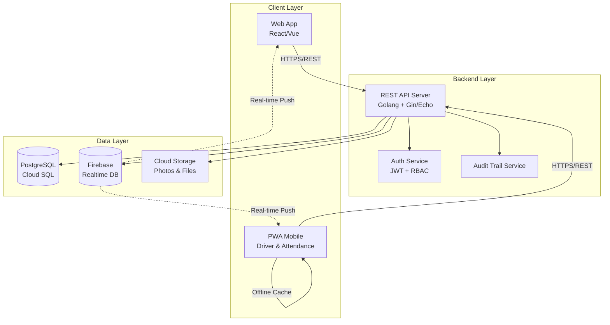
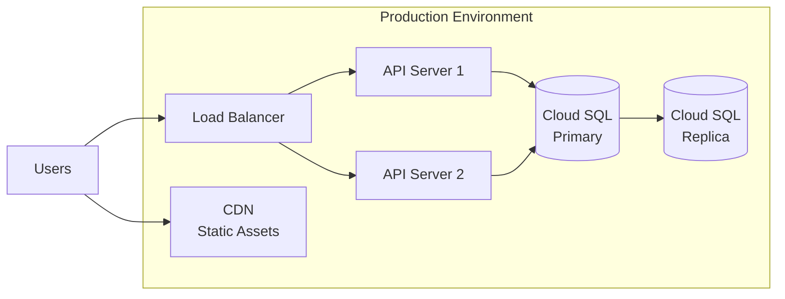

# Design Document: Sistem ERP SPPG

## Overview

Sistem ERP SPPG adalah platform manajemen operasional terintegrasi yang dirancang untuk mengelola seluruh siklus operasional program pemenuhan gizi, dari perencanaan menu hingga distribusi ke sekolah-sekolah penerima manfaat. Sistem ini terdiri dari tiga komponen utama yang saling terintegrasi:

1. **erp-sppg-be (Backend)**: REST API server menggunakan Golang dengan PostgreSQL/Cloud SQL sebagai database utama dan Firebase Realtime Database untuk push notifications dan real-time updates
2. **erp-sppg-web (Web Desktop)**: Single Page Application menggunakan React atau Vue untuk staff kantor dengan akses penuh ke semua modul manajemen
3. **erp-sppg-pwa (Progressive Web App)**: Mobile-first application untuk driver dan karyawan lapangan dengan kemampuan offline-first

### Design Principles

- **Separation of Concerns**: Setiap modul memiliki tanggung jawab yang jelas dan terisolasi
- **Real-time First**: Menggunakan Firebase untuk update real-time pada KDS, tracking delivery, dan dashboard
- **Offline Capability**: PWA dapat beroperasi tanpa koneksi internet dan melakukan sync otomatis
- **Security by Design**: RBAC ketat dengan audit trail lengkap untuk setiap aksi
- **Indonesian-First**: Semua UI, pesan, dan dokumentasi dalam Bahasa Indonesia profesional

## Architecture

### System Architecture



### Technology Stack

**Backend (erp-sppg-be)**:
- Language: Golang 1.21+
- Web Framework: Gin atau Echo
- Database: PostgreSQL 15+ (Cloud SQL)
- ORM: GORM atau sqlx
- Real-time: Firebase Admin SDK
- Authentication: JWT (golang-jwt)
- File Storage: Google Cloud Storage atau AWS S3
- Caching: Redis (optional untuk session)

**Web App (erp-sppg-web)**:
- Framework: React 18+ dengan TypeScript atau Vue 3 dengan TypeScript
- State Management: Redux Toolkit (React) atau Pinia (Vue)
- UI Library: Ant Design atau Material-UI
- Real-time: Firebase JavaScript SDK
- HTTP Client: Axios
- Charts: Recharts atau Chart.js

**PWA (erp-sppg-pwa)**:
- Framework: React atau Vue dengan PWA plugin
- Offline Storage: IndexedDB (via Dexie.js)
- Service Worker: Workbox
- Camera: Browser MediaDevices API
- Geolocation: Browser Geolocation API
- Signature: react-signature-canvas atau vue-signature-pad

### Deployment Architecture



## Components and Interfaces

### 1. Authentication & Authorization Module

#### Components

**AuthService**
- Handles user login/logout
- Generates and validates JWT tokens
- Manages session lifecycle

**RBACMiddleware**
- Intercepts all API requests
- Validates JWT token
- Checks user role permissions
- Rejects unauthorized access

**AuditTrailService**
- Records all user actions
- Stores: user_id, timestamp, action, entity, old_value, new_value
- Provides search and filtering capabilities

#### API Endpoints

```
POST   /api/v1/auth/login
POST   /api/v1/auth/logout
POST   /api/v1/auth/refresh
GET    /api/v1/auth/me
GET    /api/v1/audit-trail
```

#### Role Permissions Matrix

| Module/Feature | Kepala SPPG | Akuntan | Ahli Gizi | Pengadaan | Chef | Packing | Driver | Asisten |
|----------------|-------------|---------|-----------|-----------|------|---------|--------|---------|
| Dashboard Executive | ✓ | ✗ | ✗ | ✗ | ✗ | ✗ | ✗ | ✗ |
| Financial Reports | ✓ | ✓ | ✗ | ✗ | ✗ | ✗ | ✗ | ✗ |
| Menu Planning | ✓ | ✗ | ✓ | ✗ | ✗ | ✗ | ✗ | ✗ |
| Recipe Management | ✓ | ✗ | ✓ | ✗ | ✗ | ✗ | ✗ | ✗ |
| Kitchen Display | ✓ | ✗ | ✓ | ✗ | ✓ | ✓ | ✗ | ✗ |
| Procurement | ✓ | ✗ | ✗ | ✓ | ✗ | ✗ | ✗ | ✗ |
| Inventory | ✓ | ✓ | ✗ | ✓ | ✗ | ✗ | ✗ | ✗ |
| Delivery Tasks | ✓ | ✗ | ✗ | ✗ | ✗ | ✗ | ✓ | ✓ |
| Attendance | ✓ | ✓ | ✓ | ✓ | ✓ | ✓ | ✓ | ✓ |
| HRM Management | ✓ | ✓ | ✗ | ✗ | ✗ | ✗ | ✗ | ✗ |

### 2. Recipe & Menu Planning Module

#### Components

**RecipeService**
- CRUD operations for recipes
- Calculates nutritional values from ingredients
- Validates recipes against nutritional standards
- Maintains recipe version history

**MenuPlanningService**
- Creates weekly menu plans
- Validates daily nutritional requirements
- Calculates total ingredient requirements
- Publishes approved menus to KDS

**NutritionCalculator**
- Computes total calories, protein, carbs, fat, vitamins
- Validates against minimum standards (e.g., 600 kcal, 15g protein per portion)

#### API Endpoints

```
GET    /api/v1/recipes
POST   /api/v1/recipes
GET    /api/v1/recipes/:id
PUT    /api/v1/recipes/:id
DELETE /api/v1/recipes/:id
GET    /api/v1/recipes/:id/nutrition
GET    /api/v1/recipes/:id/history

GET    /api/v1/menu-plans
POST   /api/v1/menu-plans
GET    /api/v1/menu-plans/:id
PUT    /api/v1/menu-plans/:id
POST   /api/v1/menu-plans/:id/approve
GET    /api/v1/menu-plans/current-week
```

### 3. Kitchen Display System (KDS) Module

#### Components

**KDSService**
- Retrieves current day menu from approved weekly plan
- Updates recipe cooking status
- Triggers inventory deduction when cooking starts
- Manages packing allocation per school

**FirebaseKDSSync**
- Pushes real-time updates to KDS displays
- Listens for status changes from kitchen staff
- Maintains connection state

**PackingAllocationService**
- Calculates portion distribution per school
- Maps menu items to schools
- Tracks packing completion status

#### Firebase Real-time Structure

```
/kds
  /cooking
    /{date}
      /{recipe_id}
        - name: "Nasi Goreng"
        - status: "pending" | "cooking" | "ready"
        - start_time: timestamp
        - portions_required: 500
  /packing
    /{date}
      /{school_id}
        - school_name: "SDN 01"
        - portions: 50
        - menu_items: ["Nasi Goreng", "Sayur Asem"]
        - status: "pending" | "packing" | "ready"
```

#### API Endpoints

```
GET    /api/v1/kds/cooking/today
PUT    /api/v1/kds/cooking/:recipe_id/status
GET    /api/v1/kds/packing/today
PUT    /api/v1/kds/packing/:school_id/status
```

### 4. Supply Chain & Inventory Module

#### Components

**SupplierService**
- CRUD for supplier master data
- Tracks supplier performance metrics
- Maintains transaction history

**PurchaseOrderService**
- Creates and manages POs
- Handles approval workflow
- Sends notifications to suppliers

**GoodsReceiptService**
- Records incoming goods
- Validates against PO
- Uploads invoice photos to cloud storage
- Updates inventory levels

**InventoryService**
- Maintains real-time stock levels
- Implements FIFO/FEFO logic
- Generates low stock alerts
- Provides stock movement reports

**StockAlertService**
- Monitors inventory levels
- Triggers notifications when below threshold
- Sends alerts to procurement staff

#### API Endpoints

```
GET    /api/v1/suppliers
POST   /api/v1/suppliers
GET    /api/v1/suppliers/:id
PUT    /api/v1/suppliers/:id
GET    /api/v1/suppliers/:id/performance

GET    /api/v1/purchase-orders
POST   /api/v1/purchase-orders
GET    /api/v1/purchase-orders/:id
PUT    /api/v1/purchase-orders/:id
POST   /api/v1/purchase-orders/:id/approve

POST   /api/v1/goods-receipts
GET    /api/v1/goods-receipts/:id
POST   /api/v1/goods-receipts/:id/upload-invoice

GET    /api/v1/inventory
GET    /api/v1/inventory/:item_id
GET    /api/v1/inventory/alerts
GET    /api/v1/inventory/movements
```

### 5. Logistics & Distribution Module

#### Components

**SchoolService**
- CRUD for school master data
- Validates GPS coordinates
- Manages active/inactive status

**DeliveryTaskService**
- Creates daily delivery assignments
- Assigns tasks to drivers
- Optimizes delivery routes (optional: using Google Maps API)
- Tracks delivery status

**ePODService**
- Records delivery proof (photo, signature, GPS, timestamp)
- Validates geotagging accuracy
- Stores proof documents in cloud storage
- Updates delivery status

**OmprengTrackingService**
- Tracks ompreng drop-off and pick-up
- Maintains global ompreng inventory
- Identifies missing ompreng
- Generates circulation reports

#### API Endpoints

```
GET    /api/v1/schools
POST   /api/v1/schools
GET    /api/v1/schools/:id
PUT    /api/v1/schools/:id

GET    /api/v1/delivery-tasks
POST   /api/v1/delivery-tasks
GET    /api/v1/delivery-tasks/driver/:driver_id/today
PUT    /api/v1/delivery-tasks/:id/status

POST   /api/v1/epod
POST   /api/v1/epod/upload-photo
POST   /api/v1/epod/upload-signature

GET    /api/v1/ompreng/tracking
POST   /api/v1/ompreng/drop-off
POST   /api/v1/ompreng/pick-up
GET    /api/v1/ompreng/reports
```

### 6. Human Resource Management Module

#### Components

**EmployeeService**
- CRUD for employee master data
- Validates unique NIK and email
- Generates login credentials
- Manages employee activation status

**AttendanceService**
- Records check-in and check-out
- Validates Wi-Fi connection (SSID/BSSID)
- Calculates work hours
- Generates attendance reports

**WiFiValidationService**
- Verifies device Wi-Fi connection
- Compares against authorized networks
- Rejects attendance from unauthorized locations

#### API Endpoints

```
GET    /api/v1/employees
POST   /api/v1/employees
GET    /api/v1/employees/:id
PUT    /api/v1/employees/:id
DELETE /api/v1/employees/:id

POST   /api/v1/attendance/check-in
POST   /api/v1/attendance/check-out
POST   /api/v1/attendance/validate-wifi
GET    /api/v1/attendance/report

GET    /api/v1/wifi-config
POST   /api/v1/wifi-config
```

### 7. Financial & Asset Management Module

#### Components

**AssetService**
- CRUD for kitchen assets
- Tracks asset depreciation
- Records maintenance activities
- Generates asset reports

**CashFlowService**
- Records all financial transactions
- Categorizes transactions
- Maintains running balances
- Auto-creates entries from GRN

**FinancialReportService**
- Generates cash flow reports
- Provides budget vs actual analysis
- Exports to PDF and Excel
- Aggregates data by period

#### API Endpoints

```
GET    /api/v1/assets
POST   /api/v1/assets
GET    /api/v1/assets/:id
PUT    /api/v1/assets/:id
POST   /api/v1/assets/:id/maintenance

GET    /api/v1/cash-flow
POST   /api/v1/cash-flow
GET    /api/v1/cash-flow/summary

GET    /api/v1/financial-reports
POST   /api/v1/financial-reports/export
```

### 8. Executive Dashboard Module

#### Components

**DashboardService**
- Aggregates data from all modules
- Calculates KPIs in real-time
- Provides drill-down capabilities
- Caches frequently accessed metrics

**KPICalculator**
- Computes production milestones
- Calculates delivery completion rates
- Tracks budget absorption
- Measures supplier performance

#### Firebase Real-time Structure

```
/dashboard
  /kepala_sppg
    - production_status: {...}
    - delivery_status: {...}
    - critical_stock: [...]
    - updated_at: timestamp
  /kepala_yayasan
    - budget_absorption: 75.5
    - total_portions_distributed: 15000
    - schools_served: 30
    - supplier_performance: {...}
    - updated_at: timestamp
```

#### API Endpoints

```
GET    /api/v1/dashboard/kepala-sppg
GET    /api/v1/dashboard/kepala-yayasan
GET    /api/v1/dashboard/kpi
POST   /api/v1/dashboard/export
```

## Data Models

### User & Authentication

```go
type User struct {
    ID           uint      `gorm:"primaryKey"`
    NIK          string    `gorm:"uniqueIndex;size:20"`
    Email        string    `gorm:"uniqueIndex;size:100"`
    PasswordHash string    `gorm:"size:255"`
    FullName     string    `gorm:"size:100"`
    PhoneNumber  string    `gorm:"size:20"`
    Role         string    `gorm:"size:50"` // enum: kepala_sppg, akuntan, ahli_gizi, etc.
    IsActive     bool      `gorm:"default:true"`
    CreatedAt    time.Time
    UpdatedAt    time.Time
}

type AuditTrail struct {
    ID         uint      `gorm:"primaryKey"`
    UserID     uint      `gorm:"index"`
    Timestamp  time.Time `gorm:"index"`
    Action     string    `gorm:"size:50"` // create, update, delete, login, etc.
    Entity     string    `gorm:"size:100"` // table/resource name
    EntityID   string    `gorm:"size:100"`
    OldValue   string    `gorm:"type:text"`
    NewValue   string    `gorm:"type:text"`
    IPAddress  string    `gorm:"size:45"`
}
```

### Recipe & Menu Planning

```go
type Ingredient struct {
    ID              uint    `gorm:"primaryKey"`
    Name            string  `gorm:"size:100"`
    Unit            string  `gorm:"size:20"` // kg, liter, pcs, etc.
    CaloriesPer100g float64
    ProteinPer100g  float64
    CarbsPer100g    float64
    FatPer100g      float64
    CreatedAt       time.Time
    UpdatedAt       time.Time
}

type Recipe struct {
    ID                uint      `gorm:"primaryKey"`
    Name              string    `gorm:"size:200"`
    Category          string    `gorm:"size:50"`
    ServingSize       int       // number of portions
    Instructions      string    `gorm:"type:text"`
    TotalCalories     float64
    TotalProtein      float64
    TotalCarbs        float64
    TotalFat          float64
    Version           int       `gorm:"default:1"`
    IsActive          bool      `gorm:"default:true"`
    CreatedBy         uint
    CreatedAt         time.Time
    UpdatedAt         time.Time
    RecipeIngredients []RecipeIngredient `gorm:"foreignKey:RecipeID"`
}

type RecipeIngredient struct {
    ID           uint    `gorm:"primaryKey"`
    RecipeID     uint    `gorm:"index"`
    IngredientID uint    `gorm:"index"`
    Quantity     float64 // in ingredient's unit
    Ingredient   Ingredient `gorm:"foreignKey:IngredientID"`
}

type MenuPlan struct {
    ID         uint      `gorm:"primaryKey"`
    WeekStart  time.Time `gorm:"index"`
    WeekEnd    time.Time
    Status     string    `gorm:"size:20"` // draft, approved
    ApprovedBy uint
    ApprovedAt *time.Time
    CreatedBy  uint
    CreatedAt  time.Time
    UpdatedAt  time.Time
    MenuItems  []MenuItem `gorm:"foreignKey:MenuPlanID"`
}

type MenuItem struct {
    ID         uint      `gorm:"primaryKey"`
    MenuPlanID uint      `gorm:"index"`
    Date       time.Time `gorm:"index"`
    RecipeID   uint      `gorm:"index"`
    Portions   int
    Recipe     Recipe `gorm:"foreignKey:RecipeID"`
}
```

### Supply Chain & Inventory

```go
type Supplier struct {
    ID              uint      `gorm:"primaryKey"`
    Name            string    `gorm:"size:200"`
    ContactPerson   string    `gorm:"size:100"`
    PhoneNumber     string    `gorm:"size:20"`
    Email           string    `gorm:"size:100"`
    Address         string    `gorm:"type:text"`
    ProductCategory string    `gorm:"size:100"`
    IsActive        bool      `gorm:"default:true"`
    OnTimeDelivery  float64   // percentage
    QualityRating   float64   // 1-5 scale
    CreatedAt       time.Time
    UpdatedAt       time.Time
}

type PurchaseOrder struct {
    ID               uint      `gorm:"primaryKey"`
    PONumber         string    `gorm:"uniqueIndex;size:50"`
    SupplierID       uint      `gorm:"index"`
    OrderDate        time.Time
    ExpectedDelivery time.Time
    Status           string    `gorm:"size:20"` // pending, approved, received, cancelled
    TotalAmount      float64
    ApprovedBy       *uint
    ApprovedAt       *time.Time
    CreatedBy        uint
    CreatedAt        time.Time
    UpdatedAt        time.Time
    Supplier         Supplier `gorm:"foreignKey:SupplierID"`
    POItems          []PurchaseOrderItem `gorm:"foreignKey:POID"`
}

type PurchaseOrderItem struct {
    ID           uint    `gorm:"primaryKey"`
    POID         uint    `gorm:"index"`
    IngredientID uint    `gorm:"index"`
    Quantity     float64
    UnitPrice    float64
    Subtotal     float64
    Ingredient   Ingredient `gorm:"foreignKey:IngredientID"`
}

type GoodsReceipt struct {
    ID            uint      `gorm:"primaryKey"`
    GRNNumber     string    `gorm:"uniqueIndex;size:50"`
    POID          uint      `gorm:"index"`
    ReceiptDate   time.Time
    InvoicePhoto  string    `gorm:"size:500"` // cloud storage URL
    ReceivedBy    uint
    Notes         string    `gorm:"type:text"`
    CreatedAt     time.Time
    PurchaseOrder PurchaseOrder `gorm:"foreignKey:POID"`
    GRNItems      []GoodsReceiptItem `gorm:"foreignKey:GRNID"`
}

type GoodsReceiptItem struct {
    ID               uint    `gorm:"primaryKey"`
    GRNID            uint    `gorm:"index"`
    IngredientID     uint    `gorm:"index"`
    OrderedQuantity  float64
    ReceivedQuantity float64
    ExpiryDate       *time.Time
    Ingredient       Ingredient `gorm:"foreignKey:IngredientID"`
}

type InventoryItem struct {
    ID           uint      `gorm:"primaryKey"`
    IngredientID uint      `gorm:"uniqueIndex"`
    Quantity     float64
    MinThreshold float64
    LastUpdated  time.Time
    Ingredient   Ingredient `gorm:"foreignKey:IngredientID"`
}

type InventoryMovement struct {
    ID           uint      `gorm:"primaryKey"`
    IngredientID uint      `gorm:"index"`
    MovementType string    `gorm:"size:20"` // in, out, adjustment
    Quantity     float64
    Reference    string    `gorm:"size:100"` // GRN number, recipe ID, etc.
    MovementDate time.Time `gorm:"index"`
    CreatedBy    uint
    Notes        string    `gorm:"type:text"`
}
```

### Logistics & Distribution

```go
type School struct {
    ID            uint    `gorm:"primaryKey"`
    Name          string  `gorm:"size:200"`
    Address       string  `gorm:"type:text"`
    Latitude      float64
    Longitude     float64
    ContactPerson string  `gorm:"size:100"`
    PhoneNumber   string  `gorm:"size:20"`
    StudentCount  int
    IsActive      bool      `gorm:"default:true"`
    CreatedAt     time.Time
    UpdatedAt     time.Time
}

type DeliveryTask struct {
    ID           uint      `gorm:"primaryKey"`
    TaskDate     time.Time `gorm:"index"`
    DriverID     uint      `gorm:"index"`
    SchoolID     uint      `gorm:"index"`
    Portions     int
    Status       string    `gorm:"size:20"` // pending, in_progress, completed
    RouteOrder   int       // sequence in delivery route
    CreatedAt    time.Time
    UpdatedAt    time.Time
    Driver       User   `gorm:"foreignKey:DriverID"`
    School       School `gorm:"foreignKey:SchoolID"`
    MenuItems    []DeliveryMenuItem `gorm:"foreignKey:DeliveryTaskID"`
}

type DeliveryMenuItem struct {
    ID             uint `gorm:"primaryKey"`
    DeliveryTaskID uint `gorm:"index"`
    RecipeID       uint `gorm:"index"`
    Portions       int
    Recipe         Recipe `gorm:"foreignKey:RecipeID"`
}

type ElectronicPOD struct {
    ID               uint      `gorm:"primaryKey"`
    DeliveryTaskID   uint      `gorm:"uniqueIndex"`
    PhotoURL         string    `gorm:"size:500"`
    SignatureURL     string    `gorm:"size:500"`
    Latitude         float64
    Longitude        float64
    RecipientName    string    `gorm:"size:100"`
    OmprengDropOff   int
    OmprengPickUp    int
    CompletedAt      time.Time
    DeliveryTask     DeliveryTask `gorm:"foreignKey:DeliveryTaskID"`
}

type OmprengTracking struct {
    ID         uint      `gorm:"primaryKey"`
    SchoolID   uint      `gorm:"index"`
    Date       time.Time `gorm:"index"`
    DropOff    int
    PickUp     int
    Balance    int       // cumulative balance at school
    RecordedBy uint
    CreatedAt  time.Time
    School     School `gorm:"foreignKey:SchoolID"`
}

type OmprengInventory struct {
    ID              uint `gorm:"primaryKey"`
    TotalOwned      int  // total ompreng owned by SPPG
    AtKitchen       int  // currently at central kitchen
    InCirculation   int  // currently at schools
    Missing         int  // unaccounted for
    LastUpdated     time.Time
}
```

### Human Resources

```go
type Employee struct {
    ID          uint      `gorm:"primaryKey"`
    UserID      uint      `gorm:"uniqueIndex"` // links to User table
    NIK         string    `gorm:"uniqueIndex;size:20"`
    FullName    string    `gorm:"size:100"`
    Email       string    `gorm:"uniqueIndex;size:100"`
    PhoneNumber string    `gorm:"size:20"`
    Position    string    `gorm:"size:100"`
    JoinDate    time.Time
    IsActive    bool      `gorm:"default:true"`
    CreatedAt   time.Time
    UpdatedAt   time.Time
    User        User `gorm:"foreignKey:UserID"`
}

type Attendance struct {
    ID         uint      `gorm:"primaryKey"`
    EmployeeID uint      `gorm:"index"`
    Date       time.Time `gorm:"index"`
    CheckIn    time.Time
    CheckOut   *time.Time
    WorkHours  float64
    SSID       string    `gorm:"size:100"`
    BSSID      string    `gorm:"size:100"`
    CreatedAt  time.Time
    Employee   Employee `gorm:"foreignKey:EmployeeID"`
}

type WiFiConfig struct {
    ID        uint      `gorm:"primaryKey"`
    SSID      string    `gorm:"size:100"`
    BSSID     string    `gorm:"size:100"`
    Location  string    `gorm:"size:200"`
    IsActive  bool      `gorm:"default:true"`
    CreatedAt time.Time
    UpdatedAt time.Time
}
```

### Financial & Asset Management

```go
type KitchenAsset struct {
    ID                 uint      `gorm:"primaryKey"`
    AssetCode          string    `gorm:"uniqueIndex;size:50"`
    Name               string    `gorm:"size:200"`
    Category           string    `gorm:"size:50"`
    PurchaseDate       time.Time
    PurchasePrice      float64
    CurrentValue       float64
    DepreciationRate   float64   // annual percentage
    Condition          string    `gorm:"size:50"` // good, fair, poor
    Location           string    `gorm:"size:100"`
    CreatedAt          time.Time
    UpdatedAt          time.Time
    MaintenanceRecords []AssetMaintenance `gorm:"foreignKey:AssetID"`
}

type AssetMaintenance struct {
    ID              uint      `gorm:"primaryKey"`
    AssetID         uint      `gorm:"index"`
    MaintenanceDate time.Time
    Description     string    `gorm:"type:text"`
    Cost            float64
    PerformedBy     string    `gorm:"size:100"`
    CreatedAt       time.Time
}

type CashFlowEntry struct {
    ID            uint      `gorm:"primaryKey"`
    TransactionID string    `gorm:"uniqueIndex;size:50"`
    Date          time.Time `gorm:"index"`
    Category      string    `gorm:"size:50"` // bahan_baku, gaji, utilitas, operasional
    Type          string    `gorm:"size:20"` // income, expense
    Amount        float64
    Description   string    `gorm:"type:text"`
    Reference     string    `gorm:"size:100"` // GRN number, employee ID, etc.
    CreatedBy     uint
    CreatedAt     time.Time
}

type BudgetTarget struct {
    ID         uint      `gorm:"primaryKey"`
    Year       int       `gorm:"index"`
    Month      int       `gorm:"index"`
    Category   string    `gorm:"size:50"`
    Target     float64
    Actual     float64
    UpdatedAt  time.Time
}
```

### System Configuration

```go
type SystemConfig struct {
    ID        uint      `gorm:"primaryKey"`
    Key       string    `gorm:"uniqueIndex;size:100"`
    Value     string    `gorm:"type:text"`
    DataType  string    `gorm:"size:20"` // string, int, float, bool, json
    Category  string    `gorm:"size:50"` // nutrition, inventory, system, etc.
    UpdatedBy uint
    UpdatedAt time.Time
}

type Notification struct {
    ID        uint      `gorm:"primaryKey"`
    UserID    uint      `gorm:"index"`
    Type      string    `gorm:"size:50"` // low_stock, po_approval, delivery_complete, etc.
    Title     string    `gorm:"size:200"`
    Message   string    `gorm:"type:text"`
    IsRead    bool      `gorm:"default:false"`
    Link      string    `gorm:"size:500"` // deep link to relevant screen
    CreatedAt time.Time
}
```

## Correctness Properties

*A property is a characteristic or behavior that should hold true across all valid executions of a system—essentially, a formal statement about what the system should do. Properties serve as the bridge between human-readable specifications and machine-verifiable correctness guarantees.*

### Core System Properties

#### Property 1: Authentication Success for Valid Credentials
*For any* User with valid credentials (NIK or Email matching a record, correct password), authentication should succeed and grant access to the system.
**Validates: Requirements 1.1**

#### Property 2: Authentication Rejection for Invalid Credentials
*For any* authentication attempt with invalid credentials (non-existent NIK/Email or incorrect password), the system should reject the attempt and display an error message.
**Validates: Requirements 1.2**

#### Property 3: Role-Based Access Control
*For any* User attempting to access a feature, if the User's role does not have permission for that feature, access should be denied.
**Validates: Requirements 1.5**

#### Property 4: Audit Trail Completeness
*For any* User action that modifies data (create, update, delete), an audit trail entry should be created with User ID, timestamp, action type, entity, and values.
**Validates: Requirements 1.6, 21.1, 21.2**

#### Property 5: Nutritional Calculation Accuracy
*For any* recipe with ingredients, the total nutritional values (calories, protein, carbs, fat) should equal the sum of nutritional values from all ingredients weighted by their quantities.
**Validates: Requirements 2.2**

#### Property 6: Recipe Nutrition Recalculation
*For any* recipe update that changes ingredients or quantities, the system should automatically recalculate and update the total nutritional values.
**Validates: Requirements 2.4**

#### Property 7: Daily Menu Nutrition Aggregation
*For any* menu plan day with assigned recipes, the total daily nutritional values should equal the sum of nutritional values from all recipes for that day.
**Validates: Requirements 3.2**

#### Property 8: Ingredient Requirements Calculation
*For any* approved weekly menu, the total ingredient requirements should equal the sum of all ingredient quantities needed across all recipes in the menu, scaled by portion counts.
**Validates: Requirements 3.5**

#### Property 9: Inventory Deduction on Cooking Start
*For any* recipe that changes status to "Sedang Dimasak", the inventory quantities for all ingredients in that recipe's BoM should be decremented by the required amounts.
**Validates: Requirements 4.6**

#### Property 10: Inventory Update on Goods Receipt
*For any* completed GRN, the inventory quantities for all received items should be incremented by the received quantities.
**Validates: Requirements 8.4**

#### Property 11: FIFO/FEFO Inventory Method
*For any* inventory item with expiration dates, when items are consumed, the system should select items with the earliest expiration date first (FEFO) or earliest receipt date (FIFO) for non-perishables.
**Validates: Requirements 8.6**

#### Property 12: Real-Time Inventory Maintenance
*For any* transaction that affects inventory (GRN, production, adjustment), the inventory levels should be updated immediately and reflect the correct quantity.
**Validates: Requirements 9.1**

#### Property 13: Low Stock Alert Generation
*For any* ingredient whose quantity falls below its configured minimum threshold, a low stock alert should be generated and sent to Pengadaan staff.
**Validates: Requirements 9.2, 9.3**

#### Property 14: GPS Coordinate Validation
*For any* school record with GPS coordinates, the latitude should be between -90 and 90, and longitude should be between -180 and 180.
**Validates: Requirements 10.2**

#### Property 15: Automatic Geotagging on Delivery
*For any* delivery confirmation, the system should automatically capture and store the current GPS coordinates of the device.
**Validates: Requirements 12.1**

#### Property 16: Delivery Status Update on e-POD Completion
*For any* completed e-POD with all required data (photo, signature, GPS, ompreng counts), the delivery status should be updated to "Selesai" with a timestamp.
**Validates: Requirements 12.5**

#### Property 17: Ompreng Balance Conservation
*For any* school location, the ompreng balance should equal the cumulative sum of all drop-offs minus all pick-ups at that location.
**Validates: Requirements 13.1, 13.2**

#### Property 18: Global Ompreng Inventory Conservation
*For any* point in time, the total ompreng count (at kitchen + in circulation at all schools) should equal the total owned ompreng minus any reported missing ompreng.
**Validates: Requirements 13.3**

#### Property 19: Unique Employee Identifiers
*For any* two distinct employee records, they should have different NIK values and different email addresses.
**Validates: Requirements 14.2**

#### Property 20: Wi-Fi Validation for Attendance
*For any* attendance check-in attempt, if the device's SSID and BSSID do not match any authorized Wi-Fi configuration, the check-in should be rejected.
**Validates: Requirements 15.1, 15.2, 15.3**

#### Property 21: Work Hours Calculation
*For any* attendance record with both check-in and check-out times, the work hours should equal the time difference between check-out and check-in.
**Validates: Requirements 15.5**

#### Property 22: Asset Depreciation Calculation
*For any* kitchen asset with a purchase date, purchase price, and depreciation rate, the current book value should equal purchase price minus accumulated depreciation based on time elapsed.
**Validates: Requirements 16.4, 16.5**

#### Property 23: Automatic Cash Flow Entry from GRN
*For any* completed GRN, a corresponding cash flow entry should be automatically created with the transaction amount, date, and category "Bahan Baku".
**Validates: Requirements 17.4**

#### Property 24: Running Balance Accuracy
*For any* account category, the running balance should equal the sum of all income entries minus the sum of all expense entries in that category.
**Validates: Requirements 17.6**

#### Property 25: Financial Report Aggregation
*For any* date range, the financial report should include all and only the cash flow entries with dates within that range.
**Validates: Requirements 18.1, 18.2**

#### Property 26: Real-Time Data Push
*For any* data change in the backend that affects KDS, delivery status, inventory, or dashboards, the system should push an update to all connected clients subscribed to that data.
**Validates: Requirements 22.1, 22.2**

#### Property 27: Offline Data Sync Completeness
*For any* offline-recorded data in the PWA (e-POD, attendance, etc.), when the device reconnects, all offline data should be synced to the backend without loss.
**Validates: Requirements 23.3**

#### Property 28: Password Hashing
*For any* user password stored in the database, it should be hashed using a secure algorithm (bcrypt, argon2) and never stored in plaintext.
**Validates: Requirements 25.1**

#### Property 29: Session Timeout Enforcement
*For any* user session inactive for more than the configured timeout duration (default 30 minutes), the session should be invalidated and require re-authentication.
**Validates: Requirements 25.3, 25.4**

#### Property 30: Export Data Completeness
*For any* data export request with filters and date ranges, the exported file should contain all and only the records matching those criteria.
**Validates: Requirements 27.5**

### Property Reflection

After reviewing all properties, I've identified the following consolidations:

- **Properties 1 & 2** (authentication success/failure) are complementary and should both be tested
- **Properties 17 & 18** (ompreng tracking) are related but test different invariants - both needed
- **Properties 4, 21, 1** (audit trail) could be consolidated, but Property 4 is sufficient as the primary test
- **Properties 5, 6, 7, 8** (nutrition calculations) are all distinct and necessary for comprehensive coverage
- **Properties 10, 11, 12** (inventory) test different aspects and should all be retained

All properties provide unique validation value and should be implemented.

## Error Handling

### Error Categories

**Validation Errors**:
- Input format errors (invalid email, phone, NIK)
- Business rule violations (insufficient stock, duplicate identifiers)
- Missing required fields
- Out-of-range values (GPS coordinates, dates)

**Authentication Errors**:
- Invalid credentials
- Expired sessions
- Insufficient permissions
- Account deactivated

**System Errors**:
- Database connection failures
- Firebase connection issues
- Cloud storage upload failures
- External API failures (if any)

### Error Handling Strategy

**Client-Side Validation**:
- Validate input formats before submission
- Provide immediate feedback with Indonesian error messages
- Show inline validation as users type
- Prevent form submission if validation fails

**Server-Side Validation**:
- Re-validate all inputs (never trust client)
- Return structured error responses with error codes
- Log all validation failures for monitoring
- Return HTTP 400 for validation errors

**Error Response Format**:
```json
{
  "success": false,
  "error_code": "VALIDATION_ERROR",
  "message": "Data tidak valid",
  "details": [
    {
      "field": "email",
      "message": "Format email tidak valid"
    }
  ]
}
```

**Database Transaction Handling**:
- Wrap multi-step operations in transactions
- Rollback on any failure
- Log transaction failures
- Return appropriate error to client

**Real-Time Connection Handling**:
- Implement exponential backoff for reconnection
- Show connection status in UI
- Queue updates during disconnection
- Sync queued updates on reconnection

**Offline Error Handling (PWA)**:
- Store failed operations in IndexedDB
- Retry on reconnection
- Show sync status to user
- Handle conflicts with server state

## Testing Strategy

### Dual Testing Approach

The system requires both unit testing and property-based testing for comprehensive coverage:

**Unit Tests**: Focus on specific examples, edge cases, and integration points
**Property Tests**: Verify universal properties across randomized inputs

### Unit Testing

**Focus Areas**:
- API endpoint integration tests
- Database query correctness
- Firebase integration
- Authentication flows
- File upload/download
- Report generation
- Specific edge cases (empty lists, boundary values)

**Testing Framework**:
- Backend: Go testing package + testify for assertions
- Frontend: Jest + React Testing Library or Vitest + Vue Test Utils
- E2E: Playwright or Cypress for critical user flows

**Coverage Goals**:
- Minimum 70% code coverage
- 100% coverage for critical paths (auth, financial, inventory)
- All error handling paths tested

### Property-Based Testing

**Testing Library**: 
- Backend: gopter (Go property testing library)
- Frontend: fast-check (JavaScript/TypeScript)

**Configuration**:
- Minimum 100 iterations per property test
- Each test tagged with: **Feature: erp-sppg-system, Property {number}: {property_text}**
- Seed randomization for reproducibility

**Property Test Implementation**:

Each correctness property listed above should be implemented as a property-based test. For example:

```go
// Property 5: Nutritional Calculation Accuracy
func TestProperty5_NutritionalCalculationAccuracy(t *testing.T) {
    // Feature: erp-sppg-system, Property 5: Nutritional Calculation Accuracy
    properties := gopter.NewProperties(nil)
    
    properties.Property("recipe nutrition equals sum of ingredient nutrition", 
        prop.ForAll(
            func(recipe RecipeGenerator) bool {
                calculated := CalculateRecipeNutrition(recipe)
                expected := SumIngredientNutrition(recipe.Ingredients)
                return calculated.Equals(expected)
            },
            RecipeArbitrary(),
        ))
    
    properties.TestingRun(t, gopter.ConsoleReporter(false))
}
```

**Generator Strategy**:
- Create generators for all domain entities (User, Recipe, Ingredient, etc.)
- Generate valid and invalid inputs
- Include edge cases in generators (empty lists, zero values, boundary values)
- Use shrinking to find minimal failing examples

### Integration Testing

**Critical Workflows to Test**:
1. Complete production cycle: Menu planning → Cooking → Packing → Delivery
2. Procurement cycle: PO creation → Approval → GRN → Inventory update
3. Financial flow: Transaction → Cash flow entry → Report generation
4. Offline-online cycle: Offline data capture → Sync → Verification

**Testing Environment**:
- Separate test database
- Mock Firebase for controlled testing
- Mock cloud storage
- Test data fixtures for consistent scenarios

### Performance Testing

**Load Testing Scenarios**:
- 50 concurrent users on web app
- 20 concurrent drivers using PWA
- Real-time updates to 100 connected KDS displays
- Report generation with 1 year of data

**Performance Targets**:
- API response time: < 200ms for 95th percentile
- Real-time update latency: < 1 second
- Report generation: < 30 seconds for 10,000 records
- PWA offline sync: < 5 seconds for typical daily data

### Security Testing

**Security Test Areas**:
- SQL injection attempts on all inputs
- XSS attempts on text fields
- CSRF protection verification
- JWT token tampering
- Rate limiting effectiveness
- Session hijacking prevention
- File upload validation (size, type, malicious content)

**Tools**:
- OWASP ZAP for automated security scanning
- Manual penetration testing for critical flows
- Dependency vulnerability scanning (Snyk, Dependabot)

## Deployment Considerations

### Environment Configuration

**Development**:
- Local PostgreSQL
- Firebase emulator
- Local file storage
- Debug logging enabled

**Staging**:
- Cloud SQL (small instance)
- Firebase project (staging)
- Cloud Storage (staging bucket)
- Info-level logging

**Production**:
- Cloud SQL (HA configuration with replica)
- Firebase project (production)
- Cloud Storage (production bucket with CDN)
- Warning-level logging
- Monitoring and alerting enabled

### Database Migration Strategy

- Use migration tool (golang-migrate or similar)
- Version all schema changes
- Test migrations on staging before production
- Maintain rollback scripts
- Backup before major migrations

### Monitoring and Observability

**Metrics to Track**:
- API response times (p50, p95, p99)
- Error rates by endpoint
- Database query performance
- Firebase connection status
- Storage usage
- Active user sessions
- Background job success rates

**Logging Strategy**:
- Structured logging (JSON format)
- Log levels: DEBUG, INFO, WARNING, ERROR, CRITICAL
- Include request ID for tracing
- Log all authentication attempts
- Log all data modifications
- Centralized log aggregation (Cloud Logging, ELK stack)

**Alerting**:
- High error rate (> 5% of requests)
- Slow response times (> 1s average)
- Database connection failures
- Firebase disconnections
- Backup failures
- Low disk space
- Security events (repeated failed logins)

### Scalability Considerations

**Horizontal Scaling**:
- Stateless API servers (can add more instances)
- Load balancer distributes traffic
- Session state in Redis or JWT (no server-side sessions)

**Database Scaling**:
- Read replicas for reporting queries
- Connection pooling
- Query optimization and indexing
- Partitioning for large tables (audit_trail, inventory_movements)

**Caching Strategy**:
- Cache frequently accessed data (recipes, schools, employees)
- Cache dashboard metrics (refresh every 5 minutes)
- Use Redis for caching
- Implement cache invalidation on updates

**File Storage**:
- Use CDN for static assets
- Compress images before storage
- Implement file size limits
- Clean up old files periodically

## Future Enhancements

**Potential Features**:
- Mobile app (native iOS/Android) for better offline capability
- Advanced analytics and business intelligence dashboards
- Integration with accounting software (export to standard formats)
- Automated route optimization using Google Maps API
- Predictive inventory management using ML
- Multi-language support (English for international donors)
- SMS notifications for critical alerts
- Barcode/QR code scanning for inventory management
- Digital menu boards for schools
- Parent portal for transparency

**Technical Improvements**:
- GraphQL API for more flexible data fetching
- Microservices architecture for better scalability
- Event sourcing for complete audit trail
- CQRS pattern for read/write optimization
- Kubernetes deployment for better orchestration
- CI/CD pipeline automation
- Automated testing in deployment pipeline
- Blue-green deployment for zero-downtime updates

