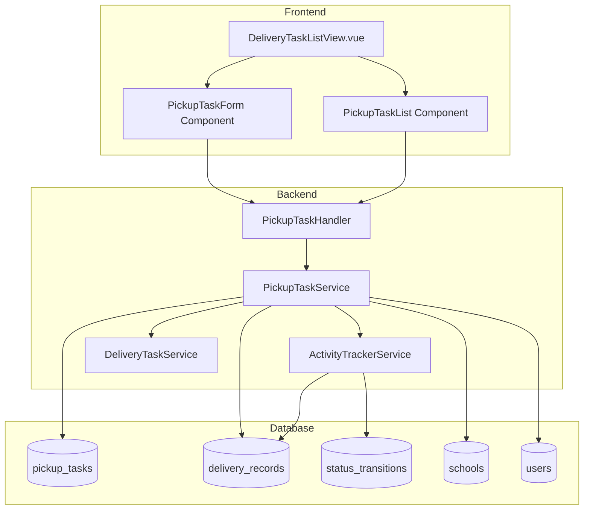
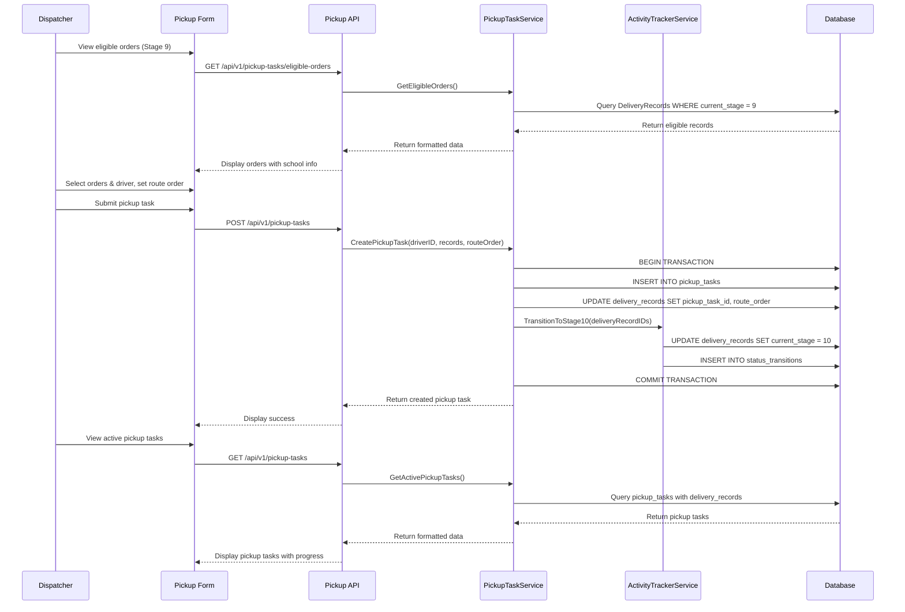
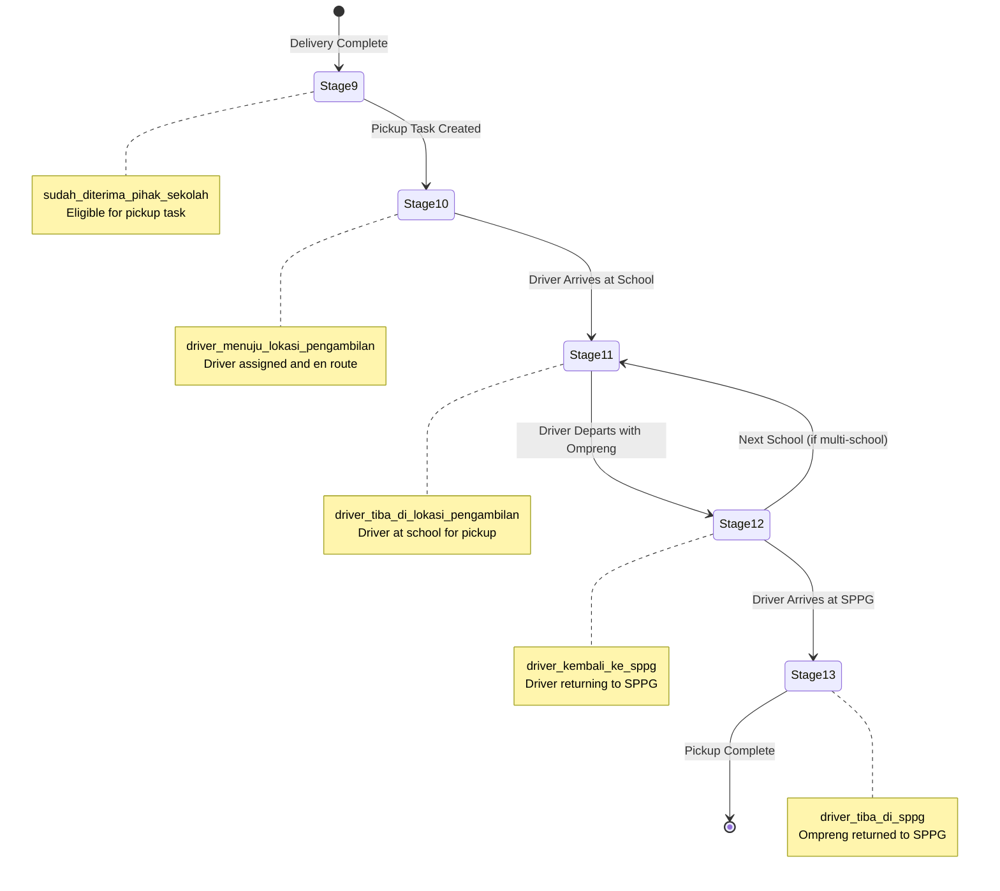
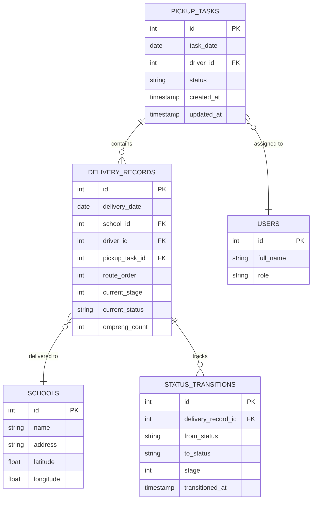

# Design Document: Pickup Task Management

## Overview

The Pickup Task Management feature extends the existing delivery workflow to handle the collection phase (stages 10-13) where drivers return to schools to collect ompreng (food containers). This feature enables dispatchers to create pickup tasks, assign drivers, plan multi-school routes, and track pickup progress until containers are returned to SPPG.

### Key Design Decisions

1. **Reuse DeliveryRecord Model**: Rather than creating a separate PickupTask model, we leverage the existing DeliveryRecord model which already tracks stages 1-16. This maintains data continuity and simplifies the architecture.

2. **New PickupTask Entity**: We introduce a lightweight PickupTask model that groups multiple DeliveryRecords for a single driver's pickup route. This provides the organizational structure needed for multi-school pickups while keeping the stage tracking in DeliveryRecord.

3. **Stage-Based Tracking**: Pickup progress is tracked through stages 10-13 in the DeliveryRecord model, consistent with the existing delivery stage pattern (stages 1-9).

4. **Frontend Integration**: The pickup form is integrated into the existing DeliveryTaskListView.vue as a separate section, allowing dispatchers to manage both delivery and pickup operations from a single interface.

5. **Individual Route Status Management**: Each school route within a pickup task can have its status updated independently through a dropdown interface in the Detail Rute Pengambilan section. This allows dispatchers to track progress for each school separately as drivers complete pickups at different times, with sequential stage validation (11→12→13) enforced to prevent skipping stages.

### Architecture Principles

- Maintain consistency with existing delivery workflow patterns
- Minimize database schema changes by reusing existing models
- Leverage existing ActivityTrackerService for stage transitions
- Follow established API endpoint conventions
- Ensure data integrity through proper validation and constraints

## Architecture

### System Components



### Data Flow



### Stage Transition Flow



## Components and Interfaces

### Backend Components

#### 1. PickupTask Model

```go
// PickupTask represents a pickup assignment for a driver to collect ompreng from one or more schools
type PickupTask struct {
    ID              uint      `gorm:"primaryKey" json:"id"`
    TaskDate        time.Time `gorm:"index;not null" json:"task_date"`
    DriverID        uint      `gorm:"index;not null" json:"driver_id"`
    Status          string    `gorm:"size:20;not null;index" json:"status"` // active, completed, cancelled
    CreatedAt       time.Time `json:"created_at"`
    UpdatedAt       time.Time `json:"updated_at"`
    Driver          User      `gorm:"foreignKey:DriverID" json:"driver,omitempty"`
    DeliveryRecords []DeliveryRecord `gorm:"foreignKey:PickupTaskID" json:"delivery_records,omitempty"`
}
```

#### 2. DeliveryRecord Model Extension

Add the following fields to the existing DeliveryRecord model:

```go
type DeliveryRecord struct {
    // ... existing fields ...
    PickupTaskID  *uint `gorm:"index" json:"pickup_task_id"` // Nullable - assigned when pickup task created
    RouteOrder    int   `gorm:"default:0" json:"route_order"` // Order in pickup route (0 if not in pickup task)
    // ... existing fields ...
}
```

#### 3. PickupTaskService

```go
type PickupTaskService struct {
    db                     *gorm.DB
    activityTrackerService *ActivityTrackerService
}

// Core service methods
func NewPickupTaskService(db *gorm.DB, ats *ActivityTrackerService) *PickupTaskService
func (s *PickupTaskService) GetEligibleOrders(date time.Time) ([]EligibleOrderResponse, error)
func (s *PickupTaskService) GetAvailableDrivers(date time.Time) ([]AvailableDriverResponse, error)
func (s *PickupTaskService) CreatePickupTask(req CreatePickupTaskRequest) (*PickupTask, error)
func (s *PickupTaskService) GetPickupTaskByID(id uint) (*PickupTask, error)
func (s *PickupTaskService) GetActivePickupTasks(date time.Time, driverID *uint) ([]PickupTask, error)
func (s *PickupTaskService) UpdatePickupTaskStatus(id uint, status string) error
func (s *PickupTaskService) UpdateDeliveryRecordStage(pickupTaskID uint, deliveryRecordID uint, stage int, status string) (*DeliveryRecord, error)
func (s *PickupTaskService) CancelPickupTask(id uint, userID uint) error
```

#### 4. PickupTaskHandler

```go
type PickupTaskHandler struct {
    service *PickupTaskService
}

// HTTP handler methods
func NewPickupTaskHandler(service *PickupTaskService) *PickupTaskHandler
func (h *PickupTaskHandler) GetEligibleOrders(c *gin.Context)
func (h *PickupTaskHandler) GetAvailableDrivers(c *gin.Context)
func (h *PickupTaskHandler) CreatePickupTask(c *gin.Context)
func (h *PickupTaskHandler) GetPickupTask(c *gin.Context)
func (h *PickupTaskHandler) GetAllPickupTasks(c *gin.Context)
func (h *PickupTaskHandler) UpdatePickupTaskStatus(c *gin.Context)
func (h *PickupTaskHandler) UpdateDeliveryRecordStage(c *gin.Context)
func (h *PickupTaskHandler) CancelPickupTask(c *gin.Context)
```

### API Endpoints

#### GET /api/v1/pickup-tasks/eligible-orders

Get delivery records that are ready for pickup (Stage 9).

**Query Parameters:**
- `date` (optional): Filter by delivery date (format: YYYY-MM-DD)

**Response:**
```json
{
  "eligible_orders": [
    {
      "delivery_record_id": 123,
      "school_id": 45,
      "school_name": "SD Negeri 1",
      "school_address": "Jl. Pendidikan No. 1",
      "latitude": -6.2088,
      "longitude": 106.8456,
      "ompreng_count": 15,
      "delivery_date": "2024-01-15T00:00:00Z",
      "current_stage": 9,
      "current_status": "sudah_diterima_pihak_sekolah"
    }
  ]
}
```

#### GET /api/v1/pickup-tasks/available-drivers

Get drivers available for pickup task assignment.

**Query Parameters:**
- `date` (optional): Filter by task date (format: YYYY-MM-DD)

**Response:**
```json
{
  "available_drivers": [
    {
      "driver_id": 10,
      "full_name": "Ahmad Supardi",
      "phone_number": "081234567890",
      "active_tasks_count": 2
    }
  ]
}
```

#### POST /api/v1/pickup-tasks

Create a new pickup task.

**Request Body:**
```json
{
  "task_date": "2024-01-15T00:00:00Z",
  "driver_id": 10,
  "delivery_records": [
    {
      "delivery_record_id": 123,
      "route_order": 1
    },
    {
      "delivery_record_id": 124,
      "route_order": 2
    }
  ]
}
```

**Response:**
```json
{
  "pickup_task": {
    "id": 50,
    "task_date": "2024-01-15T00:00:00Z",
    "driver_id": 10,
    "status": "active",
    "driver": {
      "id": 10,
      "full_name": "Ahmad Supardi"
    },
    "delivery_records": [
      {
        "id": 123,
        "school_id": 45,
        "school_name": "SD Negeri 1",
        "route_order": 1,
        "current_stage": 10,
        "current_status": "driver_menuju_lokasi_pengambilan"
      }
    ],
    "created_at": "2024-01-15T08:00:00Z"
  }
}
```

#### GET /api/v1/pickup-tasks

Get all pickup tasks with optional filters.

**Query Parameters:**
- `date` (optional): Filter by task date (format: YYYY-MM-DD)
- `driver_id` (optional): Filter by driver ID
- `status` (optional): Filter by status (active, completed, cancelled)

**Response:**
```json
{
  "pickup_tasks": [
    {
      "id": 50,
      "task_date": "2024-01-15T00:00:00Z",
      "driver_id": 10,
      "status": "active",
      "driver": {
        "id": 10,
        "full_name": "Ahmad Supardi"
      },
      "school_count": 2,
      "completed_count": 1,
      "created_at": "2024-01-15T08:00:00Z"
    }
  ]
}
```

#### GET /api/v1/pickup-tasks/:id

Get detailed information about a specific pickup task.

**Response:**
```json
{
  "pickup_task": {
    "id": 50,
    "task_date": "2024-01-15T00:00:00Z",
    "driver_id": 10,
    "status": "active",
    "driver": {
      "id": 10,
      "full_name": "Ahmad Supardi",
      "phone_number": "081234567890"
    },
    "delivery_records": [
      {
        "id": 123,
        "school_id": 45,
        "school": {
          "id": 45,
          "name": "SD Negeri 1",
          "address": "Jl. Pendidikan No. 1",
          "latitude": -6.2088,
          "longitude": 106.8456
        },
        "route_order": 1,
        "current_stage": 11,
        "current_status": "driver_tiba_di_lokasi_pengambilan",
        "ompreng_count": 15
      }
    ],
    "created_at": "2024-01-15T08:00:00Z",
    "updated_at": "2024-01-15T09:30:00Z"
  }
}
```

#### PUT /api/v1/pickup-tasks/:id/status

Update the status of a pickup task.

**Request Body:**
```json
{
  "status": "completed"
}
```

**Response:**
```json
{
  "message": "Pickup task status updated successfully",
  "pickup_task": {
    "id": 50,
    "status": "completed",
    "updated_at": "2024-01-15T16:00:00Z"
  }
}
```

#### DELETE /api/v1/pickup-tasks/:id

Cancel a pickup task (soft delete by setting status to cancelled).

**Response:**
```json
{
  "message": "Pickup task cancelled successfully"
}
```

#### PUT /api/v1/pickup-tasks/:pickup_task_id/delivery-records/:delivery_record_id/stage

Update the stage of an individual delivery record within a pickup task.

**Path Parameters:**
- `pickup_task_id`: ID of the pickup task
- `delivery_record_id`: ID of the delivery record to update

**Request Body:**
```json
{
  "stage": 11,
  "status": "driver_tiba_di_lokasi_pengambilan"
}
```

**Response:**
```json
{
  "message": "Delivery record stage updated successfully",
  "delivery_record": {
    "id": 123,
    "pickup_task_id": 50,
    "school_id": 45,
    "school_name": "SD Negeri 1",
    "route_order": 1,
    "current_stage": 11,
    "current_status": "driver_tiba_di_lokasi_pengambilan",
    "updated_at": "2024-01-15T10:30:00Z"
  }
}
```

**Error Response (Invalid Stage Transition):**
```json
{
  "error": {
    "code": "INVALID_STAGE_TRANSITION",
    "message": "Cannot skip stages. Current stage is 10, attempted stage is 12",
    "details": {
      "current_stage": 10,
      "current_status": "driver_menuju_lokasi_pengambilan",
      "attempted_stage": 12,
      "allowed_next_stage": 11,
      "allowed_next_status": "driver_tiba_di_lokasi_pengambilan"
    }
  }
}
```

### Frontend Components

#### 1. PickupTaskForm Component

A form component for creating pickup tasks, integrated into DeliveryTaskListView.vue.

**Props:**
- None (uses internal state)

**Emits:**
- `task-created`: Emitted when a pickup task is successfully created

**Key Features:**
- Displays eligible orders (Stage 9) with school information
- Driver selection dropdown
- Route order management (drag-and-drop or sequence controls)
- Form validation
- Loading states and error handling

**Component Structure:**
```vue
<template>
  <a-card title="Buat Tugas Pengambilan Ompreng">
    <!-- Eligible Orders Section -->
    <a-table
      :columns="eligibleOrderColumns"
      :data-source="eligibleOrders"
      :row-selection="rowSelection"
      :loading="loadingOrders"
    >
      <!-- School info, GPS coordinates, ompreng count -->
    </a-table>
    
    <!-- Driver Selection -->
    <a-select
      v-model:value="selectedDriver"
      placeholder="Pilih Driver"
      :options="availableDrivers"
    />
    
    <!-- Route Order Management -->
    <draggable
      v-model="selectedOrders"
      item-key="id"
    >
      <!-- Display selected schools in order -->
    </draggable>
    
    <!-- Submit Button -->
    <a-button
      type="primary"
      @click="handleSubmit"
      :disabled="!canSubmit"
    >
      Buat Tugas Pengambilan
    </a-button>
  </a-card>
</template>
```

#### 2. PickupTaskList Component

A component for displaying active pickup tasks with individual route status management.

**Props:**
- `date` (optional): Filter by date

**Emits:**
- `task-selected`: Emitted when a task is selected for viewing details
- `stage-updated`: Emitted when a delivery record stage is updated

**Key Features:**
- Displays list of active pickup tasks
- Shows driver name, school count, progress
- Expandable rows to show detailed school list with stages
- Status indicators
- Refresh functionality
- Individual status dropdown per school route in "Aksi" column
- Sequential stage validation (prevents skipping stages)

**Component Structure:**
```vue
<template>
  <a-card title="Daftar Tugas Pengambilan Aktif">
    <a-table
      :columns="pickupTaskColumns"
      :data-source="pickupTasks"
      :loading="loading"
      :expandable="expandableConfig"
    >
      <!-- Task info, driver, progress -->
      <template #expandedRowRender="{ record }">
        <!-- Detail Rute Pengambilan -->
        <a-table
          :columns="routeDetailColumns"
          :data-source="record.delivery_records"
          :pagination="false"
        >
          <!-- School name, address, GPS, current stage -->
          <template #bodyCell="{ column, record: deliveryRecord }">
            <template v-if="column.key === 'aksi'">
              <a-select
                v-model:value="deliveryRecord.selectedStage"
                :options="getAvailableStages(deliveryRecord.current_stage)"
                :disabled="deliveryRecord.current_stage === 13"
                @change="handleStageUpdate(record.id, deliveryRecord.id, $event)"
                placeholder="Pilih Status"
                style="width: 200px"
              >
              </a-select>
            </template>
          </template>
        </a-table>
      </template>
    </a-table>
  </a-card>
</template>

<script>
export default {
  methods: {
    // Returns available next stages based on current stage
    getAvailableStages(currentStage) {
      const stageMap = {
        10: [{ value: 11, label: 'Sudah Tiba (Stage 11)' }],
        11: [{ value: 12, label: 'Dalam Perjalanan Kembali (Stage 12)' }],
        12: [{ value: 13, label: 'Selesai (Stage 13)' }]
      };
      return stageMap[currentStage] || [];
    },
    
    // Handle stage update for individual delivery record
    async handleStageUpdate(pickupTaskId, deliveryRecordId, newStage) {
      try {
        const stageStatusMap = {
          11: 'driver_tiba_di_lokasi_pengambilan',
          12: 'driver_kembali_ke_sppg',
          13: 'driver_tiba_di_sppg'
        };
        
        await pickupTasksAPI.updateDeliveryRecordStage(
          pickupTaskId,
          deliveryRecordId,
          {
            stage: newStage,
            status: stageStatusMap[newStage]
          }
        );
        
        this.$message.success('Status berhasil diperbarui');
        this.$emit('stage-updated');
        this.fetchPickupTasks(); // Refresh data
      } catch (error) {
        this.$message.error(error.response?.data?.error?.message || 'Gagal memperbarui status');
      }
    }
  }
}
</script>
```

#### 3. DeliveryTaskListView Integration

The existing DeliveryTaskListView.vue will be extended to include pickup task management.

**Layout Structure:**
```vue
<template>
  <div class="delivery-task-list">
    <!-- Existing Delivery Task Section -->
    <a-page-header title="Manajemen Tugas Pengiriman" />
    <a-card>
      <!-- Existing delivery task form and list -->
    </a-card>
    
    <!-- New Pickup Task Section -->
    <a-divider />
    <a-page-header title="Manajemen Tugas Pengambilan" />
    <a-tabs>
      <a-tab-pane key="create" tab="Buat Tugas Pengambilan">
        <PickupTaskForm @task-created="handleTaskCreated" />
      </a-tab-pane>
      <a-tab-pane key="list" tab="Daftar Tugas Aktif">
        <PickupTaskList :date="filterDate" />
      </a-tab-pane>
    </a-tabs>
  </div>
</template>
```

## Data Models

### Database Schema

#### pickup_tasks Table

```sql
CREATE TABLE IF NOT EXISTS pickup_tasks (
    id SERIAL PRIMARY KEY,
    task_date DATE NOT NULL,
    driver_id INTEGER NOT NULL REFERENCES users(id),
    status VARCHAR(20) NOT NULL DEFAULT 'active',
    created_at TIMESTAMP NOT NULL DEFAULT CURRENT_TIMESTAMP,
    updated_at TIMESTAMP NOT NULL DEFAULT CURRENT_TIMESTAMP,
    
    CONSTRAINT pickup_tasks_status_check CHECK (status IN ('active', 'completed', 'cancelled'))
);

CREATE INDEX idx_pickup_tasks_task_date ON pickup_tasks(task_date);
CREATE INDEX idx_pickup_tasks_driver_id ON pickup_tasks(driver_id);
CREATE INDEX idx_pickup_tasks_status ON pickup_tasks(status);
```

#### delivery_records Table Extension

Add the following columns to the existing delivery_records table:

```sql
ALTER TABLE delivery_records 
ADD COLUMN pickup_task_id INTEGER REFERENCES pickup_tasks(id),
ADD COLUMN route_order INTEGER NOT NULL DEFAULT 0;

CREATE INDEX idx_delivery_records_pickup_task_id ON delivery_records(pickup_task_id);
```

### Data Relationships



### Data Validation Rules

1. **PickupTask Validation:**
   - `task_date` must not be in the future
   - `driver_id` must reference an existing user with role "driver"
   - `status` must be one of: active, completed, cancelled
   - At least one DeliveryRecord must be associated

2. **DeliveryRecord Validation for Pickup:**
   - `current_stage` must be 9 before assignment to PickupTask
   - `pickup_task_id` can only be set once (cannot reassign to different task)
   - `route_order` must be unique within a PickupTask
   - `route_order` must be > 0 when `pickup_task_id` is set

3. **Stage Transition Validation:**
   - Stage 10 can only be set when PickupTask is created
   - Stages 10→11→12→13 must follow sequential order
   - Stage transitions must be recorded in status_transitions table
   - Individual delivery record stage updates must validate:
     - Delivery record belongs to the specified pickup task
     - Current stage is between 10 and 12 (stage 13 is final)
     - New stage is exactly current_stage + 1 (no skipping)
     - Stage-status mapping is correct:
       - Stage 11 → "driver_tiba_di_lokasi_pengambilan"
       - Stage 12 → "driver_kembali_ke_sppg"
       - Stage 13 → "driver_tiba_di_sppg"


## Correctness Properties

*A property is a characteristic or behavior that should hold true across all valid executions of a system—essentially, a formal statement about what the system should do. Properties serve as the bridge between human-readable specifications and machine-verifiable correctness guarantees.*

### Property Reflection

After analyzing all acceptance criteria, I identified the following redundancies:
- Properties 9.2, 9.3, 9.4, 9.5 duplicate properties 2.4, 3.3, 4.4, 2.3 respectively
- Properties 10.1, 10.2, 10.3, 10.5 duplicate properties 1.3, 5.6, 5.5
- Properties 5.2, 5.3, 5.4, 5.6 can be combined into a single comprehensive property about API response completeness
- Properties 2.6 and 2.7 are both input validation properties that can be tested together

The following properties represent the unique, non-redundant validation requirements:

### Property 1: Eligible Orders Stage Filter

*For any* query to get eligible orders, all returned delivery records should have current_stage equal to 9 and should not be assigned to any active pickup task.

**Validates: Requirements 1.1, 1.4**

### Property 2: Stage Transition Eligibility

*For any* delivery record that transitions to stage 9, querying eligible orders immediately after should include that delivery record in the results.

**Validates: Requirements 1.2**

### Property 3: Eligible Orders Response Completeness

*For any* eligible order returned by the API, the response should include school name, school address, latitude, longitude, ompreng count, delivery date, current stage, and current status.

**Validates: Requirements 1.3**

### Property 4: Pickup Task Creation Persistence

*For any* valid pickup task creation request with a driver ID and delivery record IDs, the system should create a pickup_task record with the specified driver_id and associate all specified delivery records with the created task.

**Validates: Requirements 2.3, 2.4**

### Property 5: Pickup Task Creation Stage Transition

*For any* pickup task creation, all associated delivery records should transition from stage 9 to stage 10 with the status "driver_menuju_lokasi_pengambilan".

**Validates: Requirements 2.5**

### Property 6: Pickup Task Input Validation

*For any* pickup task creation request, if the request has an empty delivery records list or a missing/invalid driver ID, the system should reject the request with an appropriate error.

**Validates: Requirements 2.6, 2.7**

### Property 7: Route Order Persistence

*For any* pickup task creation with specified route orders, the system should store the route_order value for each delivery record exactly as specified in the request.

**Validates: Requirements 3.3**

### Property 8: Route Order Starts at One

*For any* pickup task with multiple delivery records, the minimum route_order value should be 1.

**Validates: Requirements 3.4**

### Property 9: Sequential Stage Transitions

*For any* delivery record in a pickup task, stage transitions should only be allowed in the sequence 10 → 11 → 12 → 13, and any attempt to skip stages or transition backwards should be rejected.

**Validates: Requirements 4.1, 4.2, 4.3, 4.5**

### Property 10: Stage Transition Timestamp Recording

*For any* stage transition, the system should create a status_transitions record with a transitioned_at timestamp that is not null and is close to the current time.

**Validates: Requirements 4.4**

### Property 11: Pickup Task Completion

*For any* pickup task where all associated delivery records have current_stage equal to 13, the pickup task status should be "completed".

**Validates: Requirements 4.6**

### Property 12: Active Pickup Tasks Filter

*For any* query to get active pickup tasks, all returned tasks should have status equal to "active" and should include driver information, delivery record count, and current stage for each delivery record.

**Validates: Requirements 5.1, 5.2, 5.3, 5.4**

### Property 13: Pickup Task Detail Route Ordering

*For any* pickup task detail query, the associated delivery records should be returned sorted by route_order in ascending order, and each record should include school name, address, GPS coordinates, and current stage.

**Validates: Requirements 5.5, 5.6**

### Property 14: Stage 9 Validation on Creation

*For any* pickup task creation request, if any of the specified delivery records have current_stage not equal to 9, the system should reject the request with an error.

**Validates: Requirements 7.1**

### Property 15: Driver Existence Validation

*For any* pickup task creation request with a driver_id, if that driver_id does not exist in the users table or the user's role is not "driver", the system should reject the request with an error.

**Validates: Requirements 7.2**

### Property 16: Route Order Uniqueness Validation

*For any* pickup task creation request, if any two delivery records have the same route_order value, the system should reject the request with an error.

**Validates: Requirements 7.3**

### Property 17: No Double Assignment

*For any* delivery record that is already assigned to an active pickup task, attempting to create a new pickup task that includes that delivery record should be rejected with an error.

**Validates: Requirements 7.4**

### Property 18: Invalid Stage Transition Rejection

*For any* invalid stage transition attempt (e.g., stage 10 to stage 13, or stage 11 to stage 10), the system should reject the transition and return an error message.

**Validates: Requirements 7.5**

### Property 19: Variable Pickup Task Size Support

*For any* pickup task creation request with 1 to N delivery records (where N is a reasonable maximum like 20), the system should successfully create the pickup task with all records associated.

**Validates: Requirements 8.1**

### Property 20: Independent Stage Tracking

*For any* pickup task with multiple delivery records, transitioning one delivery record to a new stage should not affect the current_stage of other delivery records in the same pickup task.

**Validates: Requirements 8.2, 8.4**

### Property 21: Multi-School Progress Tracking

*For any* pickup task with multiple delivery records, the API response should include individual current_stage values for each delivery record, allowing independent progress tracking.

**Validates: Requirements 8.3**

### Property 22: Pickup Task Round Trip

*For any* pickup task that is created, retrieving that pickup task by ID should return data that matches the original creation request (driver_id, task_date, delivery record associations, route orders).

**Validates: Requirements 9.1, 9.6**

### Property 23: Individual Delivery Record Stage Update

*For any* delivery record within a pickup task and any valid next stage selection, updating that delivery record's stage through the API should transition the delivery record to the selected stage without affecting other delivery records in the same pickup task.

**Validates: Requirements 11.4, 11.13**

### Property 24: Sequential Stage Enforcement Per Route

*For any* delivery record in a pickup task at stage N (where N is 10, 11, or 12), attempting to transition to any stage other than N+1 should be rejected with an error indicating the invalid transition.

**Validates: Requirements 11.5, 11.6**

### Property 25: Dropdown Shows Only Valid Next Stage

*For any* delivery record at stage N (where N is 10, 11, or 12), the status dropdown should contain exactly one option representing stage N+1, and no other stage options.

**Validates: Requirements 11.7, 11.8, 11.9, 11.10**

### Property 26: Dropdown Disabled at Final Stage

*For any* delivery record that has reached stage 13, the status dropdown should be disabled or hidden, preventing further stage transitions.

**Validates: Requirements 11.11**

### Property 27: UI Reflects Stage Update Immediately

*For any* successful delivery record stage update, querying the pickup task detail immediately after should return the updated stage value for that delivery record.

**Validates: Requirements 11.12**

## Error Handling

### Error Categories

1. **Validation Errors (400 Bad Request)**
   - Empty delivery records list
   - Missing or invalid driver ID
   - Delivery records not in stage 9
   - Duplicate route order values
   - Delivery record already assigned to active pickup task
   - Invalid stage transition sequence

2. **Not Found Errors (404 Not Found)**
   - Pickup task ID does not exist
   - Driver ID does not exist
   - Delivery record ID does not exist

3. **Conflict Errors (409 Conflict)**
   - Attempting to assign delivery record that's already in an active pickup task
   - Attempting to transition to an invalid stage

4. **Server Errors (500 Internal Server Error)**
   - Database connection failures
   - Transaction rollback failures
   - Unexpected errors during processing

### Error Response Format

All error responses follow a consistent format:

```json
{
  "error": {
    "code": "VALIDATION_ERROR",
    "message": "Human-readable error message",
    "details": {
      "field": "specific_field_name",
      "reason": "Detailed reason for the error"
    }
  }
}
```

### Error Handling Strategies

1. **Input Validation:**
   - Validate all inputs before processing
   - Return specific error messages indicating which validation failed
   - Use database constraints as a second layer of validation

2. **Transaction Management:**
   - Wrap pickup task creation in a database transaction
   - Rollback on any error to maintain data consistency
   - Log transaction failures for debugging

3. **Idempotency:**
   - Pickup task creation is not idempotent (creates new task each time)
   - Stage transitions are idempotent (transitioning to current stage is a no-op)
   - Cancellation is idempotent (cancelling a cancelled task succeeds)

4. **Graceful Degradation:**
   - If ActivityTrackerService fails, log error but don't fail the entire request
   - If Firebase sync fails, log error but don't fail the database operation
   - Return partial data with warnings if some related data is unavailable

### Specific Error Scenarios

#### Scenario 1: Creating Pickup Task with Invalid Delivery Records

**Request:**
```json
{
  "driver_id": 10,
  "delivery_records": [
    {"delivery_record_id": 123, "route_order": 1},
    {"delivery_record_id": 124, "route_order": 2}
  ]
}
```

**Error (if record 124 is at stage 8):**
```json
{
  "error": {
    "code": "INVALID_STAGE",
    "message": "One or more delivery records are not eligible for pickup",
    "details": {
      "invalid_records": [
        {
          "delivery_record_id": 124,
          "current_stage": 8,
          "required_stage": 9
        }
      ]
    }
  }
}
```

#### Scenario 2: Double Assignment Attempt

**Error:**
```json
{
  "error": {
    "code": "ALREADY_ASSIGNED",
    "message": "One or more delivery records are already assigned to an active pickup task",
    "details": {
      "conflicting_records": [
        {
          "delivery_record_id": 123,
          "existing_pickup_task_id": 45
        }
      ]
    }
  }
}
```

#### Scenario 3: Invalid Stage Transition

**Request:**
```
PUT /api/v1/monitoring/deliveries/123/status
{
  "new_status": "driver_tiba_di_sppg",
  "stage": 13
}
```

**Error (if current stage is 10):**
```json
{
  "error": {
    "code": "INVALID_TRANSITION",
    "message": "Invalid stage transition",
    "details": {
      "current_stage": 10,
      "current_status": "driver_menuju_lokasi_pengambilan",
      "attempted_stage": 13,
      "attempted_status": "driver_tiba_di_sppg",
      "allowed_next_stages": [11]
    }
  }
}
```

#### Scenario 4: Invalid Individual Route Stage Transition

**Request:**
```
PUT /api/v1/pickup-tasks/50/delivery-records/123/stage
{
  "stage": 13,
  "status": "driver_tiba_di_sppg"
}
```

**Error (if current stage is 11):**
```json
{
  "error": {
    "code": "INVALID_STAGE_TRANSITION",
    "message": "Cannot skip stages. Current stage is 11, attempted stage is 13",
    "details": {
      "delivery_record_id": 123,
      "pickup_task_id": 50,
      "school_name": "SD Negeri 1",
      "current_stage": 11,
      "current_status": "driver_tiba_di_lokasi_pengambilan",
      "attempted_stage": 13,
      "allowed_next_stage": 12,
      "allowed_next_status": "driver_kembali_ke_sppg"
    }
  }
}
```

#### Scenario 5: Delivery Record Not in Pickup Task

**Request:**
```
PUT /api/v1/pickup-tasks/50/delivery-records/999/stage
{
  "stage": 11,
  "status": "driver_tiba_di_lokasi_pengambilan"
}
```

**Error:**
```json
{
  "error": {
    "code": "DELIVERY_RECORD_NOT_FOUND",
    "message": "Delivery record 999 is not part of pickup task 50",
    "details": {
      "delivery_record_id": 999,
      "pickup_task_id": 50
    }
  }
}
```

## Testing Strategy

### Dual Testing Approach

This feature requires both unit tests and property-based tests to ensure comprehensive coverage:

- **Unit tests**: Verify specific examples, edge cases, and error conditions
- **Property tests**: Verify universal properties across all inputs

Together, these approaches provide comprehensive coverage where unit tests catch concrete bugs and property tests verify general correctness.

### Property-Based Testing

We will use the **testify** and **go-fuzz** libraries for property-based testing in Go. Each property test will:

- Run a minimum of 100 iterations with randomized inputs
- Reference the corresponding design document property in a comment
- Use the tag format: `// Feature: ompreng-pickup-task-management, Property {number}: {property_text}`

#### Example Property Test Structure

```go
// Feature: ompreng-pickup-task-management, Property 1: Eligible Orders Stage Filter
func TestProperty_EligibleOrdersStageFilter(t *testing.T) {
    // Run 100 iterations with random data
    for i := 0; i < 100; i++ {
        // Generate random delivery records with various stages
        records := generateRandomDeliveryRecords(10)
        
        // Query eligible orders
        eligible, err := service.GetEligibleOrders(time.Now())
        require.NoError(t, err)
        
        // Verify all returned records are at stage 9 and not assigned
        for _, order := range eligible {
            assert.Equal(t, 9, order.CurrentStage)
            assert.Nil(t, order.PickupTaskID)
        }
    }
}
```

### Unit Testing Strategy

Unit tests will focus on:

1. **Specific Examples:**
   - Creating a pickup task with 1 school
   - Creating a pickup task with 3 schools
   - Transitioning through stages 10→11→12→13
   - Cancelling a pickup task

2. **Edge Cases:**
   - Empty delivery records list
   - Maximum number of schools in one task
   - Concurrent pickup task creation attempts
   - Stage transition at exact boundaries
   - Attempting to update stage for delivery record not in pickup task
   - Attempting to update stage 13 (final stage)
   - Concurrent stage updates for different delivery records in same pickup task

3. **Error Conditions:**
   - Invalid driver ID
   - Delivery records not at stage 9
   - Duplicate route orders
   - Double assignment attempts
   - Invalid stage transitions
   - Skipping stages in individual route updates
   - Updating delivery record not in specified pickup task
   - Attempting to transition from stage 13

4. **Integration Points:**
   - ActivityTrackerService integration
   - Database transaction rollback
   - Foreign key constraint enforcement

### Test Coverage Goals

- **Line Coverage**: Minimum 80% for service layer
- **Branch Coverage**: Minimum 75% for conditional logic
- **Property Coverage**: 100% of correctness properties must have corresponding property tests
- **Error Path Coverage**: All error scenarios must be tested

### Testing Tools

- **Unit Testing**: Go's built-in `testing` package with `testify/assert`
- **Property Testing**: `go-fuzz` for fuzzing, custom property test framework
- **Database Testing**: In-memory SQLite or PostgreSQL test containers
- **API Testing**: `httptest` for HTTP handler testing
- **Mocking**: `testify/mock` for service dependencies

### Test Data Management

- Use factory functions to generate test data
- Implement random data generators for property tests
- Use database transactions with rollback for test isolation
- Seed random generators for reproducible test failures

### Continuous Integration

- Run all tests on every commit
- Run property tests with extended iterations (1000+) nightly
- Track test coverage trends over time
- Fail builds on coverage regression


## Implementation Notes

### Database Migration

Create a new migration file: `backend/migrations/create_pickup_tasks_table.sql`

```sql
-- Migration: Create pickup_tasks table and extend delivery_records
-- Date: 2024-01-15

BEGIN;

-- Create pickup_tasks table
CREATE TABLE IF NOT EXISTS pickup_tasks (
    id SERIAL PRIMARY KEY,
    task_date DATE NOT NULL,
    driver_id INTEGER NOT NULL REFERENCES users(id),
    status VARCHAR(20) NOT NULL DEFAULT 'active',
    created_at TIMESTAMP NOT NULL DEFAULT CURRENT_TIMESTAMP,
    updated_at TIMESTAMP NOT NULL DEFAULT CURRENT_TIMESTAMP,
    
    CONSTRAINT pickup_tasks_status_check CHECK (status IN ('active', 'completed', 'cancelled'))
);

-- Create indexes for pickup_tasks
CREATE INDEX idx_pickup_tasks_task_date ON pickup_tasks(task_date);
CREATE INDEX idx_pickup_tasks_driver_id ON pickup_tasks(driver_id);
CREATE INDEX idx_pickup_tasks_status ON pickup_tasks(status);

-- Extend delivery_records table
ALTER TABLE delivery_records 
ADD COLUMN IF NOT EXISTS pickup_task_id INTEGER REFERENCES pickup_tasks(id),
ADD COLUMN IF NOT EXISTS route_order INTEGER NOT NULL DEFAULT 0;

-- Create index for pickup_task_id
CREATE INDEX idx_delivery_records_pickup_task_id ON delivery_records(pickup_task_id);

-- Add constraint to ensure route_order is positive when pickup_task_id is set
ALTER TABLE delivery_records
ADD CONSTRAINT delivery_records_route_order_check 
CHECK (
    (pickup_task_id IS NULL AND route_order = 0) OR 
    (pickup_task_id IS NOT NULL AND route_order > 0)
);

COMMIT;
```

### Service Implementation Order

1. **Phase 1: Core Models and Database**
   - Add PickupTask model to `backend/internal/models/logistics.go`
   - Extend DeliveryRecord model with pickup_task_id and route_order
   - Run database migration
   - Update GORM auto-migration if needed

2. **Phase 2: Service Layer**
   - Implement PickupTaskService in `backend/internal/services/pickup_task_service.go`
   - Implement core methods: GetEligibleOrders, CreatePickupTask, GetActivePickupTasks
   - Integrate with ActivityTrackerService for stage transitions
   - Add validation logic

3. **Phase 3: API Layer**
   - Implement PickupTaskHandler in `backend/internal/handlers/pickup_task_handler.go`
   - Add API routes to `backend/internal/router/router.go`
   - Add authentication and authorization middleware
   - Implement request/response DTOs

4. **Phase 4: Frontend Components**
   - Create PickupTaskForm component
   - Create PickupTaskList component with individual route status dropdowns
   - Integrate into DeliveryTaskListView.vue
   - Add API client methods (including updateDeliveryRecordStage)
   - Implement drag-and-drop for route ordering
   - Implement stage dropdown with sequential validation
   - Add error handling for invalid stage transitions

5. **Phase 5: Testing**
   - Write unit tests for service layer
   - Write property-based tests for correctness properties
   - Write API integration tests
   - Write frontend component tests

### API Route Registration

Add the following routes to `backend/internal/router/router.go`:

```go
// Pickup Task routes
pickupTasks := protected.Group("/pickup-tasks")
{
    pickupTasks.GET("/eligible-orders", pickupTaskHandler.GetEligibleOrders)
    pickupTasks.GET("/available-drivers", pickupTaskHandler.GetAvailableDrivers)
    pickupTasks.GET("", pickupTaskHandler.GetAllPickupTasks)
    pickupTasks.POST("", pickupTaskHandler.CreatePickupTask)
    pickupTasks.GET("/:id", pickupTaskHandler.GetPickupTask)
    pickupTasks.PUT("/:id/status", pickupTaskHandler.UpdatePickupTaskStatus)
    pickupTasks.PUT("/:id/delivery-records/:delivery_record_id/stage", pickupTaskHandler.UpdateDeliveryRecordStage)
    pickupTasks.DELETE("/:id", pickupTaskHandler.CancelPickupTask)
}
```

### Authorization Requirements

The following roles should have access to pickup task endpoints:

- **kepala_sppg**: Full access (create, view, update, cancel)
- **kepala_yayasan**: Full access (create, view, update, cancel)
- **asisten_lapangan**: Create and view access
- **driver**: View own pickup tasks only

Add role-based middleware:

```go
pickupTasks.Use(middleware.RequireRole("kepala_sppg", "kepala_yayasan", "asisten_lapangan", "driver"))
```

### Frontend Dependencies

The frontend will require the following npm packages:

```json
{
  "dependencies": {
    "vuedraggable": "^4.1.0"
  }
}
```

Install with: `npm install vuedraggable`

### API Client Methods

Add the following methods to the frontend API client (e.g., `web/src/api/pickupTasks.js`):

```javascript
import axios from 'axios';

const API_BASE = '/api/v1/pickup-tasks';

export const pickupTasksAPI = {
  getEligibleOrders: (date) => 
    axios.get(`${API_BASE}/eligible-orders`, { params: { date } }),
  
  getAvailableDrivers: (date) => 
    axios.get(`${API_BASE}/available-drivers`, { params: { date } }),
  
  createPickupTask: (data) => 
    axios.post(API_BASE, data),
  
  getPickupTasks: (params) => 
    axios.get(API_BASE, { params }),
  
  getPickupTask: (id) => 
    axios.get(`${API_BASE}/${id}`),
  
  updatePickupTaskStatus: (id, status) => 
    axios.put(`${API_BASE}/${id}/status`, { status }),
  
  updateDeliveryRecordStage: (pickupTaskId, deliveryRecordId, data) =>
    axios.put(`${API_BASE}/${pickupTaskId}/delivery-records/${deliveryRecordId}/stage`, data),
  
  cancelPickupTask: (id) => 
    axios.delete(`${API_BASE}/${id}`)
};
```

### Performance Considerations

1. **Database Queries:**
   - Use eager loading for related data (driver, schools) to avoid N+1 queries
   - Add composite indexes for common query patterns
   - Consider pagination for large result sets

2. **Caching:**
   - Cache eligible orders list for 30 seconds (data changes infrequently)
   - Cache available drivers list for 1 minute
   - Invalidate cache on pickup task creation

3. **Transaction Optimization:**
   - Keep transactions short and focused
   - Use optimistic locking for concurrent updates
   - Batch status transitions when possible

### Security Considerations

1. **Input Validation:**
   - Validate all user inputs on both frontend and backend
   - Sanitize inputs to prevent SQL injection
   - Validate route order values are within reasonable bounds

2. **Authorization:**
   - Verify user has permission to create pickup tasks
   - Verify driver assignment is valid
   - Prevent unauthorized access to other users' pickup tasks

3. **Data Integrity:**
   - Use database constraints to enforce data rules
   - Use transactions to maintain consistency
   - Validate foreign key references before insertion

### Monitoring and Logging

1. **Logging:**
   - Log all pickup task creation events
   - Log stage transition events
   - Log validation failures with details
   - Log transaction rollbacks

2. **Metrics:**
   - Track pickup task creation rate
   - Track average time per stage
   - Track pickup task completion rate
   - Track validation error rate

3. **Alerts:**
   - Alert on high validation error rate
   - Alert on transaction rollback rate exceeding threshold
   - Alert on pickup tasks stuck in stage 10 for > 2 hours

### Future Enhancements

1. **Route Optimization:**
   - Implement automatic route ordering based on GPS coordinates
   - Suggest optimal pickup sequence to minimize travel time
   - Integration with mapping services for real-time traffic

2. **Driver Mobile App:**
   - Mobile view of assigned pickup tasks
   - GPS tracking during pickup route
   - One-tap stage transitions
   - Offline support for poor connectivity areas

3. **Analytics Dashboard:**
   - Pickup efficiency metrics
   - Driver performance tracking
   - Ompreng circulation analytics
   - Predictive analytics for pickup scheduling

4. **Notifications:**
   - Push notifications to drivers when pickup task assigned
   - SMS notifications to schools before driver arrival
   - Email notifications to dispatchers on task completion

5. **Advanced Features:**
   - Multi-day pickup task scheduling
   - Recurring pickup patterns
   - Driver preference management
   - School pickup time windows

## Appendix

### Stage Definitions Reference

| Stage | Status Code | Indonesian Description | English Description |
|-------|-------------|------------------------|---------------------|
| 9 | sudah_diterima_pihak_sekolah | Pesanan sudah diterima | Order received by school |
| 10 | driver_menuju_lokasi_pengambilan | Driver menuju lokasi pengambilan | Driver en route to pickup location |
| 11 | driver_tiba_di_lokasi_pengambilan | Driver sudah tiba di lokasi | Driver arrived at pickup location |
| 12 | driver_kembali_ke_sppg | Driver kembali ke SPPG | Driver returning to SPPG |
| 13 | driver_tiba_di_sppg | Driver tiba di SPPG | Driver arrived at SPPG |

### Related Documentation

- **Delivery Workflow**: See existing delivery task documentation for stages 1-9
- **Activity Tracker**: See `backend/internal/services/activity_tracker_service.go` for stage transition logic
- **Monitoring Service**: See `backend/internal/services/monitoring_service.go` for status validation
- **Database Schema**: See `backend/migrations/` for complete schema definitions

### Glossary

- **SPPG**: Satuan Pendidikan Penyelenggara Gizi (Central food preparation facility)
- **Ompreng**: Food containers that must be collected and cleaned
- **Stage**: A specific status in the delivery/pickup workflow (1-16)
- **Route Order**: The sequence number indicating the order in which schools should be visited
- **Eligible Order**: A delivery record at stage 9 that is ready for pickup task assignment
- **Active Pickup Task**: A pickup task with status "active" (not completed or cancelled)

---

**Document Version**: 1.0  
**Last Updated**: 2024-01-15  
**Author**: System Design Team  
**Status**: Ready for Implementation
