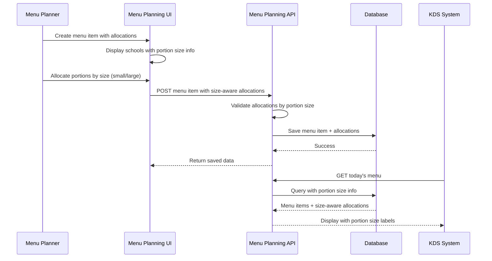

# Design Document: Portion Size Differentiation

## Overview

This feature introduces portion size differentiation for elementary schools (SD) in the menu planning system. Currently, all schools are treated uniformly with a single portion size. This enhancement enables the system to distinguish between small portions (for SD grades 1-3) and large portions (for SD grades 4-6, SMP, and SMA), allowing more accurate meal planning and allocation based on student age groups.

The system will track two portion types per SD school using existing student count fields (`student_count_grade_1_3` and `student_count_grade_4_6`), while SMP and SMA schools continue using a single large portion size. This differentiation affects menu planning allocation, KDS displays, and logistics tracking.

## Main Algorithm/Workflow



## Core Interfaces/Types

```pascal
STRUCTURE School
  id: Integer
  name: String
  category: String  // 'SD', 'SMP', 'SMA'
  student_count: Integer  // Total for SMP/SMA
  student_count_grade_1_3: Integer  // SD only
  student_count_grade_4_6: Integer  // SD only
  portion_size: String  // 'small', 'large', 'mixed'
END STRUCTURE

STRUCTURE MenuItemSchoolAllocation
  id: Integer
  menu_item_id: Integer
  school_id: Integer
  portions: Integer
  portion_size: String  // 'small' or 'large'
  date: Date
END STRUCTURE

STRUCTURE AllocationInput
  school_id: Integer
  portions_small: Integer  // For SD grades 1-3
  portions_large: Integer  // For SD grades 4-6, SMP, SMA
END STRUCTURE

STRUCTURE SchoolAllocationDisplay
  school_id: Integer
  school_name: String
  school_category: String
  portion_size_type: String  // 'small', 'large', 'mixed'
  portions_small: Integer
  portions_large: Integer
  total_portions: Integer
END STRUCTURE
```


## Key Functions with Formal Specifications

### Function 1: DetermineSchoolPortionType()

```pascal
FUNCTION DetermineSchoolPortionType(school)
  INPUT: school of type School
  OUTPUT: portion_type of type String
```

**Preconditions:**
- `school` is non-null and well-formed
- `school.category` is one of: 'SD', 'SMP', 'SMA'

**Postconditions:**
- Returns 'mixed' if school.category = 'SD'
- Returns 'large' if school.category = 'SMP' OR school.category = 'SMA'
- No side effects on input school

**Loop Invariants:** N/A (no loops)

### Function 2: ValidatePortionSizeAllocations()

```pascal
FUNCTION ValidatePortionSizeAllocations(allocations, total_portions)
  INPUT: allocations of type Array<AllocationInput>, total_portions of type Integer
  OUTPUT: validation_result of type Boolean, error_message of type String
```

**Preconditions:**
- `allocations` is a valid array (may be empty)
- `total_portions` is a positive integer
- Each allocation has valid school_id, portions_small >= 0, portions_large >= 0

**Postconditions:**
- Returns (true, "") if sum of all portions equals total_portions
- Returns (false, error_message) if validation fails
- Error message describes specific validation failure
- No mutations to input parameters

**Loop Invariants:**
- For validation loops: Running sum never exceeds total_portions + maximum_single_allocation
- All previously validated allocations remain valid

### Function 3: CreateMenuItemWithPortionSizes()

```pascal
FUNCTION CreateMenuItemWithPortionSizes(menu_item_data, allocations)
  INPUT: menu_item_data of type MenuItemInput, allocations of type Array<AllocationInput>
  OUTPUT: created_menu_item of type MenuItem, error of type Error
```

**Preconditions:**
- `menu_item_data` is validated and well-formed
- `allocations` array is non-empty
- All school_ids in allocations exist in database
- Sum of all portions equals menu_item_data.total_portions

**Postconditions:**
- If successful: Returns created menu item with all allocations persisted
- If error: Returns null menu item and descriptive error
- Database transaction is committed on success, rolled back on failure
- For SD schools: Creates two allocation records (one small, one large) if both > 0
- For SMP/SMA schools: Creates one allocation record with portion_size = 'large'

**Loop Invariants:**
- All previously created allocations are valid and persisted
- Transaction state remains consistent throughout iteration

### Function 4: GetSchoolAllocationsWithPortionSizes()

```pascal
FUNCTION GetSchoolAllocationsWithPortionSizes(menu_item_id)
  INPUT: menu_item_id of type Integer
  OUTPUT: allocations of type Array<SchoolAllocationDisplay>
```

**Preconditions:**
- `menu_item_id` is a positive integer
- Menu item exists in database

**Postconditions:**
- Returns array of allocations grouped by school
- For SD schools: Combines small and large allocations into single display record
- For SMP/SMA schools: Returns single allocation with portion_size = 'large'
- Allocations are ordered alphabetically by school name
- Each allocation includes school name, category, and portion breakdown

**Loop Invariants:**
- All processed allocations are properly grouped by school_id
- Running total of portions matches database records

## Algorithmic Pseudocode

### Main Processing Algorithm

```pascal
ALGORITHM ProcessMenuItemWithPortionSizes(menu_item_input, allocation_inputs)
INPUT: menu_item_input of type MenuItemInput, allocation_inputs of type Array<AllocationInput>
OUTPUT: result of type MenuItem OR error of type Error

BEGIN
  // Step 1: Validate input structure
  ASSERT menu_item_input IS NOT NULL
  ASSERT allocation_inputs IS NOT EMPTY
  
  // Step 2: Validate portion sum
  total_allocated ← 0
  FOR each allocation IN allocation_inputs DO
    total_allocated ← total_allocated + allocation.portions_small + allocation.portions_large
  END FOR
  
  IF total_allocated ≠ menu_item_input.total_portions THEN
    RETURN Error("Sum of allocated portions does not match total")
  END IF
  
  // Step 3: Validate schools exist and determine portion types
  validated_allocations ← Empty Array
  FOR each allocation IN allocation_inputs DO
    school ← FetchSchoolFromDatabase(allocation.school_id)
    
    IF school IS NULL THEN
      RETURN Error("School not found: " + allocation.school_id)
    END IF
    
    portion_type ← DetermineSchoolPortionType(school)
    
    // Validate allocation matches school type
    IF portion_type = 'large' AND allocation.portions_small > 0 THEN
      RETURN Error("SMP/SMA schools cannot have small portions")
    END IF
    
    IF portion_type = 'mixed' AND (allocation.portions_small < 0 OR allocation.portions_large < 0) THEN
      RETURN Error("SD schools must have non-negative portions for both sizes")
    END IF
    
    validated_allocations.Add(allocation)
  END FOR
  
  // Step 4: Create menu item and allocations in transaction
  BEGIN TRANSACTION
    menu_item ← CreateMenuItem(menu_item_input)
    
    FOR each allocation IN validated_allocations DO
      school ← FetchSchoolFromDatabase(allocation.school_id)
      
      IF school.category = 'SD' THEN
        // Create two allocation records for SD schools
        IF allocation.portions_small > 0 THEN
          CreateAllocation(menu_item.id, school.id, allocation.portions_small, 'small')
        END IF
        
        IF allocation.portions_large > 0 THEN
          CreateAllocation(menu_item.id, school.id, allocation.portions_large, 'large')
        END IF
      ELSE
        // Create single allocation for SMP/SMA
        CreateAllocation(menu_item.id, school.id, allocation.portions_large, 'large')
      END IF
    END FOR
    
  COMMIT TRANSACTION
  
  RETURN menu_item
END
```

**Preconditions:**
- menu_item_input contains valid recipe_id, date, and total_portions
- allocation_inputs is a non-empty array
- Database connection is available

**Postconditions:**
- Menu item and all allocations are persisted in database
- For SD schools: Up to 2 allocation records created (small and large)
- For SMP/SMA schools: Exactly 1 allocation record created (large only)
- Transaction is committed on success, rolled back on any error

**Loop Invariants:**
- All validated allocations have existing school_ids
- Running sum of portions equals total_portions
- All created allocations are valid and consistent

### Validation Algorithm

```pascal
ALGORITHM ValidateAllocationsByPortionSize(allocations, total_portions)
INPUT: allocations of type Array<AllocationInput>, total_portions of type Integer
OUTPUT: is_valid of type Boolean, error_message of type String

BEGIN
  // Check for empty allocations
  IF allocations.Length = 0 THEN
    RETURN (false, "At least one school allocation is required")
  END IF
  
  // Calculate total and validate individual allocations
  total_small ← 0
  total_large ← 0
  school_set ← Empty Set
  
  FOR each allocation IN allocations DO
    // Check for duplicate schools
    IF school_set.Contains(allocation.school_id) THEN
      RETURN (false, "Duplicate allocation for school: " + allocation.school_id)
    END IF
    school_set.Add(allocation.school_id)
    
    // Validate portion counts are non-negative
    IF allocation.portions_small < 0 THEN
      RETURN (false, "Small portions cannot be negative for school: " + allocation.school_id)
    END IF
    
    IF allocation.portions_large < 0 THEN
      RETURN (false, "Large portions cannot be negative for school: " + allocation.school_id)
    END IF
    
    // At least one portion type must be positive
    IF allocation.portions_small = 0 AND allocation.portions_large = 0 THEN
      RETURN (false, "School must have at least one portion: " + allocation.school_id)
    END IF
    
    // Accumulate totals
    total_small ← total_small + allocation.portions_small
    total_large ← total_large + allocation.portions_large
  END FOR
  
  // Validate sum equals total
  total_allocated ← total_small + total_large
  IF total_allocated ≠ total_portions THEN
    RETURN (false, "Sum of allocated portions (" + total_allocated + ") does not equal total portions (" + total_portions + ")")
  END IF
  
  // All validations passed
  RETURN (true, "")
END
```

**Preconditions:**
- allocations parameter is provided (may be empty array)
- total_portions is a positive integer

**Postconditions:**
- Returns (true, "") if and only if all validations pass
- Returns (false, descriptive_message) if any validation fails
- No side effects on input parameters

**Loop Invariants:**
- All previously checked allocations have unique school_ids
- Running totals (total_small, total_large) accurately reflect processed allocations
- school_set contains all processed school_ids without duplicates

### Retrieval Algorithm

```pascal
ALGORITHM RetrieveAllocationsGroupedBySchool(menu_item_id)
INPUT: menu_item_id of type Integer
OUTPUT: grouped_allocations of type Array<SchoolAllocationDisplay>

BEGIN
  // Step 1: Fetch all allocations for menu item
  raw_allocations ← QueryDatabase("SELECT * FROM menu_item_school_allocations WHERE menu_item_id = ?", menu_item_id)
  
  // Step 2: Group allocations by school
  school_map ← Empty Map<Integer, SchoolAllocationDisplay>
  
  FOR each allocation IN raw_allocations DO
    school_id ← allocation.school_id
    
    // Initialize school entry if not exists
    IF NOT school_map.Contains(school_id) THEN
      school ← FetchSchoolFromDatabase(school_id)
      
      school_map[school_id] ← SchoolAllocationDisplay{
        school_id: school_id,
        school_name: school.name,
        school_category: school.category,
        portion_size_type: DetermineSchoolPortionType(school),
        portions_small: 0,
        portions_large: 0,
        total_portions: 0
      }
    END IF
    
    // Accumulate portions by size
    IF allocation.portion_size = 'small' THEN
      school_map[school_id].portions_small ← school_map[school_id].portions_small + allocation.portions
    ELSE IF allocation.portion_size = 'large' THEN
      school_map[school_id].portions_large ← school_map[school_id].portions_large + allocation.portions
    END IF
    
    school_map[school_id].total_portions ← school_map[school_id].total_portions + allocation.portions
  END FOR
  
  // Step 3: Convert map to sorted array
  result ← Empty Array
  FOR each entry IN school_map.Values DO
    result.Add(entry)
  END FOR
  
  // Sort by school name alphabetically
  SortArray(result, BY school_name ASCENDING)
  
  RETURN result
END
```

**Preconditions:**
- menu_item_id is a valid positive integer
- Database connection is available

**Postconditions:**
- Returns array of allocations grouped by school
- Each school appears exactly once in result
- For SD schools: portions_small and portions_large may both be > 0
- For SMP/SMA schools: portions_small = 0, portions_large > 0
- Result is sorted alphabetically by school name
- Sum of all total_portions equals original menu item total

**Loop Invariants:**
- school_map contains unique school_ids as keys
- For each school in map: total_portions = portions_small + portions_large
- All processed allocations are correctly categorized by portion_size

## Example Usage

```pascal
// Example 1: Create menu item with SD school (mixed portions)
SEQUENCE
  menu_item_input ← MenuItemInput{
    recipe_id: 5,
    date: "2024-01-15",
    total_portions: 500
  }
  
  allocations ← [
    AllocationInput{
      school_id: 1,  // SD Negeri 1
      portions_small: 150,  // Grades 1-3
      portions_large: 200   // Grades 4-6
    },
    AllocationInput{
      school_id: 2,  // SMP Negeri 1
      portions_small: 0,
      portions_large: 150
    }
  ]
  
  result ← ProcessMenuItemWithPortionSizes(menu_item_input, allocations)
  
  IF result IS Error THEN
    DISPLAY "Error: " + result.message
  ELSE
    DISPLAY "Menu item created successfully with ID: " + result.id
  END IF
END SEQUENCE

// Example 2: Validate allocations before submission
SEQUENCE
  allocations ← [
    AllocationInput{school_id: 1, portions_small: 100, portions_large: 150},
    AllocationInput{school_id: 2, portions_small: 0, portions_large: 200}
  ]
  
  total_portions ← 500
  
  (is_valid, error_msg) ← ValidateAllocationsByPortionSize(allocations, total_portions)
  
  IF is_valid THEN
    DISPLAY "Allocations are valid, ready to submit"
  ELSE
    DISPLAY "Validation error: " + error_msg
  END IF
END SEQUENCE

// Example 3: Retrieve and display allocations with portion sizes
SEQUENCE
  menu_item_id ← 42
  
  allocations ← RetrieveAllocationsGroupedBySchool(menu_item_id)
  
  FOR each allocation IN allocations DO
    DISPLAY allocation.school_name + " (" + allocation.school_category + ")"
    
    IF allocation.portion_size_type = 'mixed' THEN
      DISPLAY "  Small portions (Grades 1-3): " + allocation.portions_small
      DISPLAY "  Large portions (Grades 4-6): " + allocation.portions_large
    ELSE
      DISPLAY "  Large portions: " + allocation.portions_large
    END IF
    
    DISPLAY "  Total: " + allocation.total_portions
  END FOR
END SEQUENCE

// Example 4: Error handling for invalid allocation
SEQUENCE
  allocations ← [
    AllocationInput{
      school_id: 1,  // SD school
      portions_small: 200,
      portions_large: 150
    },
    AllocationInput{
      school_id: 2,  // SMP school
      portions_small: 50,  // ERROR: SMP cannot have small portions
      portions_large: 100
    }
  ]
  
  result ← ProcessMenuItemWithPortionSizes(menu_item_input, allocations)
  
  // Expected: Error("SMP/SMA schools cannot have small portions")
  DISPLAY result.error_message
END SEQUENCE
```

## Correctness Properties

### Property 1: Portion Size Type Consistency

*For any* school in the system, the portion size type must be consistent with its category: SD schools must have portion_size_type = 'mixed', while SMP and SMA schools must have portion_size_type = 'large'.

### Property 2: Allocation Sum Preservation

*For any* menu item with portion size allocations, the sum of all portions_small and portions_large across all schools must equal the menu item's total_portions value.

### Property 3: SD School Dual Allocation

*For any* SD school with both small and large portion allocations, the system must create exactly two allocation records: one with portion_size = 'small' and one with portion_size = 'large'.

### Property 4: SMP/SMA Single Allocation

*For any* SMP or SMA school allocation, the system must create exactly one allocation record with portion_size = 'large' and portions_small = 0.

### Property 5: Non-Negative Portion Validation

*For any* allocation input, both portions_small and portions_large must be non-negative integers, and at least one must be greater than zero.

### Property 6: Duplicate School Prevention

*For any* menu item creation request, each school_id must appear at most once in the allocations array, preventing duplicate allocations for the same school.

### Property 7: Retrieval Grouping Correctness

*For any* menu item with multiple allocation records for the same SD school (one small, one large), the retrieval function must group them into a single SchoolAllocationDisplay record with both portion sizes populated.

### Property 8: Alphabetical Ordering

*For any* set of school allocations retrieved from the system, the results must be ordered alphabetically by school name in ascending order.

### Property 9: Transaction Atomicity

*For any* menu item creation with multiple allocations, either all allocations are successfully persisted or none are persisted (transaction rollback on any failure).

### Property 10: Portion Size Label Accuracy

*For any* allocation record in the database, the portion_size field must accurately reflect the student grade level: 'small' for SD grades 1-3, 'large' for SD grades 4-6 and all SMP/SMA students.
