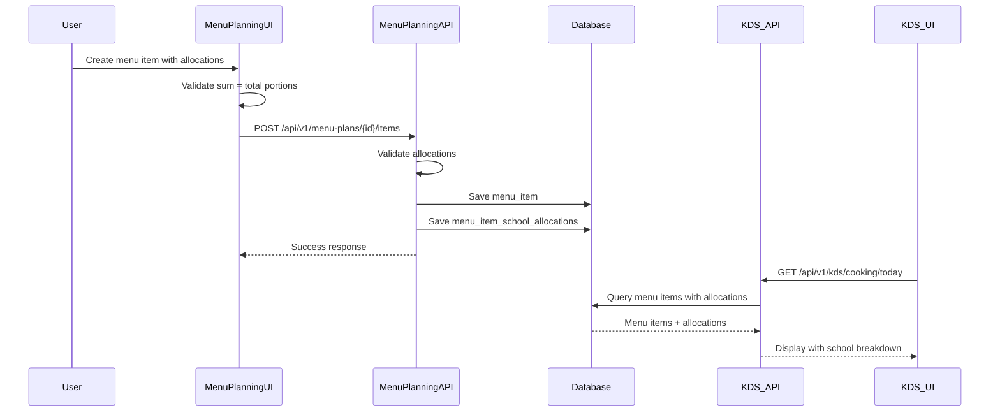
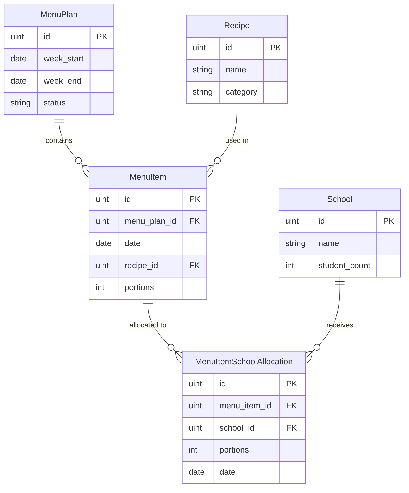

# Design Document: School Allocation Menu Planning

## Overview

This feature extends the existing menu planning system to support school-level portion allocation. Currently, the system tracks only total portions per menu item per day. This enhancement adds the ability to specify which schools receive which portions during menu plan creation, providing granular control over meal distribution.

The design introduces a new junction table `menu_item_school_allocations` that links menu items to schools with specific portion counts. School allocations are mandatory - menu items cannot be saved without complete allocation data that sums to the total portions. This ensures data integrity and provides accurate information for the KDS (Kitchen Display System) cooking and packing workflows.

Key design principles:
- School allocations are mandatory for all menu items
- Allocation sum must equal total portions (enforced at API level)
- Allocations are input directly in the menu item form (no separate step)
- Allocation data is displayed in both KDS cooking and packing views
- Database referential integrity is maintained through foreign keys
- API validation prevents inconsistent data states

## Architecture

### System Components

The feature integrates with existing system components:

1. **Menu Planning Module** (Backend)
   - Handles menu plan and menu item CRUD operations
   - Validates school allocation data
   - Enforces business rules (mandatory allocations, sum validation)
   - Provides allocation data to other modules

2. **KDS Service** (Backend)
   - Retrieves menu items with school allocations for cooking view
   - Displays school breakdown alongside recipe information
   - Syncs allocation data to Firebase for real-time updates

3. **Packing Allocation Service** (Backend)
   - Retrieves school-specific allocations for packing view
   - Groups allocations by school for packing workflow
   - Provides school-centric view of daily allocations

4. **Menu Planning UI** (Frontend - Vue 3)
   - Provides form interface for entering school allocations
   - Displays real-time validation feedback
   - Shows allocation summary in menu plan view

5. **KDS UI** (Frontend - PWA)
   - Displays school allocations in cooking view
   - Shows school-grouped allocations in packing view

### Data Flow



### Integration Points

1. **Menu Planning Handler** (`menu_planning_handler.go`)
   - Modified to accept school allocations in request payload
   - Enhanced validation logic for allocation rules
   - Returns allocations in response data

2. **KDS Handler** (`kds_handler.go`)
   - Modified to include school allocations in cooking view response
   - No changes to packing view (already school-centric)

3. **Database Migration** (`migrate.go`)
   - Adds new `menu_item_school_allocations` table
   - Creates indexes for performance optimization

4. **Frontend Menu Planning Form**
   - Adds school allocation input section
   - Implements client-side validation
   - Displays allocation summary

## Components and Interfaces

### Database Schema

#### New Table: menu_item_school_allocations

```sql
CREATE TABLE menu_item_school_allocations (
    id SERIAL PRIMARY KEY,
    menu_item_id INTEGER NOT NULL REFERENCES menu_items(id) ON DELETE CASCADE,
    school_id INTEGER NOT NULL REFERENCES schools(id) ON DELETE RESTRICT,
    portions INTEGER NOT NULL CHECK (portions > 0),
    date DATE NOT NULL,
    created_at TIMESTAMP NOT NULL DEFAULT CURRENT_TIMESTAMP,
    updated_at TIMESTAMP NOT NULL DEFAULT CURRENT_TIMESTAMP,
    
    -- Prevent duplicate allocations for same menu item + school
    UNIQUE(menu_item_id, school_id),
    
    -- Indexes for query performance
    INDEX idx_menu_item_allocations_menu_item (menu_item_id),
    INDEX idx_menu_item_allocations_school (school_id),
    INDEX idx_menu_item_allocations_date (date)
);
```

**Design Rationale:**
- `menu_item_id`: Foreign key to menu_items with CASCADE delete (when menu item is deleted, allocations are automatically removed)
- `school_id`: Foreign key to schools with RESTRICT delete (prevents deleting schools that have allocations)
- `portions`: Positive integer constraint ensures valid portion counts
- `date`: Denormalized from menu_item for query performance (allows efficient date-based filtering)
- `UNIQUE(menu_item_id, school_id)`: Prevents duplicate allocations (Requirement 8)
- Indexes on menu_item_id, school_id, and date optimize common query patterns

### Go Models

#### MenuItemSchoolAllocation Model

```go
// MenuItemSchoolAllocation represents portions of a menu item allocated to a specific school
type MenuItemSchoolAllocation struct {
    ID         uint      `gorm:"primaryKey" json:"id"`
    MenuItemID uint      `gorm:"index;not null" json:"menu_item_id"`
    SchoolID   uint      `gorm:"index;not null" json:"school_id"`
    Portions   int       `gorm:"not null;check:portions > 0" json:"portions" validate:"required,gt=0"`
    Date       time.Time `gorm:"index;not null" json:"date"`
    CreatedAt  time.Time `json:"created_at"`
    UpdatedAt  time.Time `json:"updated_at"`
    
    // Relationships
    MenuItem   MenuItem  `gorm:"foreignKey:MenuItemID" json:"menu_item,omitempty"`
    School     School    `gorm:"foreignKey:SchoolID" json:"school,omitempty"`
}
```

#### Updated MenuItem Model

```go
// MenuItem represents a recipe assigned to a specific day in a menu plan
type MenuItem struct {
    ID                  uint                        `gorm:"primaryKey" json:"id"`
    MenuPlanID          uint                        `gorm:"index;not null" json:"menu_plan_id"`
    Date                time.Time                   `gorm:"index;not null" json:"date"`
    RecipeID            uint                        `gorm:"index;not null" json:"recipe_id"`
    Portions            int                         `gorm:"not null" json:"portions" validate:"required,gt=0"`
    MenuPlan            MenuPlan                    `gorm:"foreignKey:MenuPlanID" json:"menu_plan,omitempty"`
    Recipe              Recipe                      `gorm:"foreignKey:RecipeID" json:"recipe,omitempty"`
    SchoolAllocations   []MenuItemSchoolAllocation  `gorm:"foreignKey:MenuItemID" json:"school_allocations,omitempty"`
}
```

### API Endpoints

#### Create Menu Item with Allocations

**Endpoint:** `POST /api/v1/menu-plans/{menu_plan_id}/items`

**Request Body:**
```json
{
  "date": "2024-01-15",
  "recipe_id": 5,
  "portions": 500,
  "school_allocations": [
    {
      "school_id": 1,
      "portions": 200
    },
    {
      "school_id": 2,
      "portions": 150
    },
    {
      "school_id": 3,
      "portions": 150
    }
  ]
}
```

**Validation Rules:**
1. `school_allocations` array must not be empty (Requirement 7)
2. Sum of `school_allocations[].portions` must equal `portions` (Requirement 2)
3. Each `school_id` must exist in schools table (Requirement 1.4)
4. Each `school_id` must be unique in the array (Requirement 8)
5. Each `portions` value must be a positive integer (Requirement 9)

**Response (Success - 201 Created):**
```json
{
  "success": true,
  "data": {
    "id": 42,
    "menu_plan_id": 10,
    "date": "2024-01-15T00:00:00Z",
    "recipe_id": 5,
    "portions": 500,
    "recipe": {
      "id": 5,
      "name": "Nasi Goreng Ayam",
      "category": "Main Course"
    },
    "school_allocations": [
      {
        "id": 100,
        "menu_item_id": 42,
        "school_id": 1,
        "school_name": "SD Negeri 1",
        "portions": 200,
        "date": "2024-01-15T00:00:00Z"
      },
      {
        "id": 101,
        "menu_item_id": 42,
        "school_id": 2,
        "school_name": "SD Negeri 2",
        "portions": 150,
        "date": "2024-01-15T00:00:00Z"
      },
      {
        "id": 102,
        "menu_item_id": 42,
        "school_id": 3,
        "school_name": "SD Negeri 3",
        "portions": 150,
        "date": "2024-01-15T00:00:00Z"
      }
    ]
  }
}
```

**Response (Validation Error - 400 Bad Request):**
```json
{
  "success": false,
  "error_code": "VALIDATION_ERROR",
  "message": "Validation failed",
  "details": {
    "field": "school_allocations",
    "error": "Sum of allocated portions (450) does not equal total portions (500)"
  }
}
```

#### Update Menu Item with Allocations

**Endpoint:** `PUT /api/v1/menu-plans/{menu_plan_id}/items/{item_id}`

**Request Body:** Same as create endpoint

**Behavior:**
- Replaces all existing school allocations with new ones
- Validates same rules as create operation
- Returns updated menu item with allocations

#### Get Menu Item with Allocations

**Endpoint:** `GET /api/v1/menu-plans/{menu_plan_id}/items/{item_id}`

**Response:**
```json
{
  "success": true,
  "data": {
    "id": 42,
    "menu_plan_id": 10,
    "date": "2024-01-15T00:00:00Z",
    "recipe_id": 5,
    "portions": 500,
    "recipe": {
      "id": 5,
      "name": "Nasi Goreng Ayam"
    },
    "school_allocations": [
      {
        "id": 100,
        "school_id": 1,
        "school_name": "SD Negeri 1",
        "portions": 200
      }
    ]
  }
}
```

#### Get KDS Cooking View with Allocations

**Endpoint:** `GET /api/v1/kds/cooking/today?date=2024-01-15`

**Response:**
```json
{
  "success": true,
  "data": [
    {
      "recipe_id": 5,
      "recipe_name": "Nasi Goreng Ayam",
      "category": "Main Course",
      "total_portions": 500,
      "status": "pending",
      "school_allocations": [
        {
          "school_id": 1,
          "school_name": "SD Negeri 1",
          "portions": 200
        },
        {
          "school_id": 2,
          "school_name": "SD Negeri 2",
          "portions": 150
        },
        {
          "school_id": 3,
          "school_name": "SD Negeri 3",
          "portions": 150
        }
      ]
    }
  ]
}
```

#### Get KDS Packing View with Allocations

**Endpoint:** `GET /api/v1/kds/packing/today?date=2024-01-15`

**Response:**
```json
{
  "success": true,
  "data": [
    {
      "school_id": 1,
      "school_name": "SD Negeri 1",
      "status": "pending",
      "menu_items": [
        {
          "recipe_id": 5,
          "recipe_name": "Nasi Goreng Ayam",
          "portions": 200
        },
        {
          "recipe_id": 8,
          "recipe_name": "Ayam Bakar",
          "portions": 180
        }
      ]
    },
    {
      "school_id": 2,
      "school_name": "SD Negeri 2",
      "status": "pending",
      "menu_items": [
        {
          "recipe_id": 5,
          "recipe_name": "Nasi Goreng Ayam",
          "portions": 150
        }
      ]
    }
  ]
}
```

### Service Layer

#### MenuPlanningService

New methods to add:

```go
// ValidateSchoolAllocations validates that school allocations meet business rules
func (s *MenuPlanningService) ValidateSchoolAllocations(
    totalPortions int,
    allocations []SchoolAllocationInput,
) error {
    // Check if allocations exist (Requirement 7)
    if len(allocations) == 0 {
        return errors.New("at least one school allocation is required")
    }
    
    // Check for duplicate schools (Requirement 8)
    schoolSet := make(map[uint]bool)
    sum := 0
    
    for _, alloc := range allocations {
        // Check for duplicates
        if schoolSet[alloc.SchoolID] {
            return fmt.Errorf("duplicate allocation for school_id %d", alloc.SchoolID)
        }
        schoolSet[alloc.SchoolID] = true
        
        // Validate portion count (Requirement 9)
        if alloc.Portions <= 0 {
            return fmt.Errorf("portions must be positive for school_id %d", alloc.SchoolID)
        }
        
        sum += alloc.Portions
    }
    
    // Validate sum equals total (Requirement 2)
    if sum != totalPortions {
        return fmt.Errorf(
            "sum of allocated portions (%d) does not equal total portions (%d)",
            sum,
            totalPortions,
        )
    }
    
    return nil
}

// CreateMenuItemWithAllocations creates a menu item and its school allocations
func (s *MenuPlanningService) CreateMenuItemWithAllocations(
    ctx context.Context,
    menuPlanID uint,
    input MenuItemInput,
) (*MenuItem, error) {
    // Validate allocations
    if err := s.ValidateSchoolAllocations(input.Portions, input.SchoolAllocations); err != nil {
        return nil, err
    }
    
    // Verify all schools exist
    for _, alloc := range input.SchoolAllocations {
        var school School
        if err := s.db.First(&school, alloc.SchoolID).Error; err != nil {
            return nil, fmt.Errorf("school_id %d not found", alloc.SchoolID)
        }
    }
    
    // Create menu item and allocations in transaction
    var menuItem MenuItem
    err := s.db.Transaction(func(tx *gorm.DB) error {
        // Create menu item
        menuItem = MenuItem{
            MenuPlanID: menuPlanID,
            Date:       input.Date,
            RecipeID:   input.RecipeID,
            Portions:   input.Portions,
        }
        if err := tx.Create(&menuItem).Error; err != nil {
            return err
        }
        
        // Create allocations
        for _, alloc := range input.SchoolAllocations {
            allocation := MenuItemSchoolAllocation{
                MenuItemID: menuItem.ID,
                SchoolID:   alloc.SchoolID,
                Portions:   alloc.Portions,
                Date:       input.Date,
            }
            if err := tx.Create(&allocation).Error; err != nil {
                return err
            }
        }
        
        return nil
    })
    
    if err != nil {
        return nil, err
    }
    
    // Load relationships
    s.db.Preload("Recipe").Preload("SchoolAllocations.School").First(&menuItem, menuItem.ID)
    
    return &menuItem, nil
}
```

#### KDSService

Modified method:

```go
// GetTodayMenu retrieves today's menu with school allocations
func (s *KDSService) GetTodayMenu(ctx context.Context, date time.Time) ([]RecipeStatus, error) {
    var menuItems []MenuItem
    
    // Query menu items for the date with allocations
    err := s.db.
        Preload("Recipe").
        Preload("SchoolAllocations.School").
        Where("date = ?", date).
        Order("recipe_id").
        Find(&menuItems).Error
    
    if err != nil {
        return nil, err
    }
    
    // Transform to RecipeStatus with school allocations
    recipeMap := make(map[uint]*RecipeStatus)
    
    for _, item := range menuItems {
        if _, exists := recipeMap[item.RecipeID]; !exists {
            recipeMap[item.RecipeID] = &RecipeStatus{
                RecipeID:          item.RecipeID,
                RecipeName:        item.Recipe.Name,
                Category:          item.Recipe.Category,
                TotalPortions:     item.Portions,
                Status:            "pending", // Get from cache or default
                SchoolAllocations: []SchoolAllocationResponse{},
            }
        }
        
        // Add school allocations
        for _, alloc := range item.SchoolAllocations {
            recipeMap[item.RecipeID].SchoolAllocations = append(
                recipeMap[item.RecipeID].SchoolAllocations,
                SchoolAllocationResponse{
                    SchoolID:   alloc.SchoolID,
                    SchoolName: alloc.School.Name,
                    Portions:   alloc.Portions,
                },
            )
        }
    }
    
    // Convert map to slice and sort by school name
    result := make([]RecipeStatus, 0, len(recipeMap))
    for _, status := range recipeMap {
        sort.Slice(status.SchoolAllocations, func(i, j int) bool {
            return status.SchoolAllocations[i].SchoolName < status.SchoolAllocations[j].SchoolName
        })
        result = append(result, *status)
    }
    
    return result, nil
}
```

### Frontend Components

#### Menu Item Form Component

**Location:** `web/src/components/MenuPlanning/MenuItemForm.vue`

**Key Features:**
- Input field for total portions
- Dynamic list of schools with portion input fields
- Real-time calculation of allocated sum
- Validation error display
- Visual indicator when sum matches total

**Component Structure:**
```vue
<template>
  <a-form :model="formData" @submit="handleSubmit">
    <!-- Recipe Selection -->
    <a-form-item label="Recipe" required>
      <a-select v-model:value="formData.recipe_id">
        <a-select-option v-for="recipe in recipes" :key="recipe.id" :value="recipe.id">
          {{ recipe.name }}
        </a-select-option>
      </a-select>
    </a-form-item>
    
    <!-- Total Portions -->
    <a-form-item label="Total Portions" required>
      <a-input-number v-model:value="formData.portions" :min="1" />
    </a-form-item>
    
    <!-- School Allocations -->
    <a-form-item label="School Allocations" required>
      <div v-for="school in schools" :key="school.id" class="allocation-row">
        <span class="school-name">{{ school.name }}</span>
        <a-input-number 
          v-model:value="allocations[school.id]" 
          :min="0" 
          placeholder="0"
          @change="validateAllocations"
        />
      </div>
      
      <!-- Allocation Summary -->
      <div class="allocation-summary" :class="{ 'valid': isAllocationValid, 'invalid': !isAllocationValid }">
        <span>Allocated: {{ totalAllocated }} / {{ formData.portions }}</span>
        <span v-if="!isAllocationValid" class="error-text">
          {{ allocationError }}
        </span>
      </div>
    </a-form-item>
    
    <a-form-item>
      <a-button type="primary" html-type="submit" :disabled="!isAllocationValid">
        Save Menu Item
      </a-button>
    </a-form-item>
  </a-form>
</template>

<script setup>
import { ref, computed, watch } from 'vue';

const formData = ref({
  recipe_id: null,
  portions: 0,
  date: null
});

const allocations = ref({});
const schools = ref([]);

const totalAllocated = computed(() => {
  return Object.values(allocations.value).reduce((sum, val) => sum + (val || 0), 0);
});

const isAllocationValid = computed(() => {
  if (formData.value.portions === 0) return false;
  if (totalAllocated.value === 0) return false;
  return totalAllocated.value === formData.value.portions;
});

const allocationError = computed(() => {
  if (totalAllocated.value === 0) {
    return 'Please allocate portions to at least one school';
  }
  if (totalAllocated.value < formData.value.portions) {
    return `Need to allocate ${formData.value.portions - totalAllocated.value} more portions`;
  }
  if (totalAllocated.value > formData.value.portions) {
    return `Over-allocated by ${totalAllocated.value - formData.value.portions} portions`;
  }
  return '';
});

const handleSubmit = async () => {
  // Transform allocations to API format
  const school_allocations = Object.entries(allocations.value)
    .filter(([_, portions]) => portions > 0)
    .map(([school_id, portions]) => ({
      school_id: parseInt(school_id),
      portions
    }));
  
  const payload = {
    ...formData.value,
    school_allocations
  };
  
  // API call to create menu item
  await createMenuItem(payload);
};
</script>
```

## Data Models

### Core Entities

1. **MenuItem** (existing, modified)
   - Represents a recipe assigned to a date with total portions
   - Now includes relationship to SchoolAllocations

2. **MenuItemSchoolAllocation** (new)
   - Junction entity linking MenuItem and School
   - Contains portion count for specific school
   - Includes denormalized date for query performance

3. **School** (existing, unchanged)
   - Represents schools receiving meal deliveries

### Entity Relationships



### Data Constraints

1. **MenuItemSchoolAllocation**
   - `portions > 0` (database check constraint)
   - `UNIQUE(menu_item_id, school_id)` (prevents duplicates)
   - Foreign key constraints with appropriate cascade rules

2. **Business Rules** (enforced at application level)
   - Sum of allocations must equal MenuItem.portions
   - At least one allocation required per menu item
   - All school_ids must exist in schools table

## Correctness Properties

*A property is a characteristic or behavior that should hold true across all valid executions of a system—essentially, a formal statement about what the system should do. Properties serve as the bridge between human-readable specifications and machine-verifiable correctness guarantees.*

### Property 1: Allocation Persistence and Multiplicity

*For any* menu item created with multiple school allocations, when retrieved from the database, all allocations should be present with correct school IDs, portion counts, and dates matching the original input.

**Validates: Requirements 1.2, 1.3**

### Property 2: Invalid School Rejection

*For any* menu item creation request with a school ID that does not exist in the schools table, the system should reject the request and return a validation error indicating the invalid school ID.

**Validates: Requirements 1.4**

### Property 3: Allocation Sum Validation

*For any* menu item with school allocations where the sum of allocated portions does not equal the total portions, the system should reject the save operation and return a validation error with the mismatch details.

**Validates: Requirements 2.2**

### Property 4: Valid Allocation Round Trip

*For any* menu item with school allocations where the sum equals the total portions and all schools exist, saving and then retrieving the menu item should return identical allocation data (school IDs, portions, and date).

**Validates: Requirements 2.4**

### Property 5: Cascade Delete Behavior

*For any* menu item with school allocations, when the menu item is deleted, querying for allocations with that menu_item_id should return zero results.

**Validates: Requirements 3.3**

### Property 6: Date-Based Allocation Retrieval

*For any* set of menu items with allocations across multiple dates, querying allocations for a specific date should return only allocations matching that date, with all allocations for that date included.

**Validates: Requirements 4.1**

### Property 7: Menu Item Allocation Retrieval

*For any* menu item with school allocations, querying allocations by menu_item_id should return all allocations for that menu item and no allocations from other menu items.

**Validates: Requirements 4.2**

### Property 8: Allocation Response Completeness

*For any* allocation retrieval request, each returned allocation should include school_id, school_name, and portions fields with non-null values.

**Validates: Requirements 4.3**

### Property 9: Alphabetical School Ordering

*For any* set of school allocations returned by the API (cooking view or packing view), the allocations should be ordered alphabetically by school name in ascending order.

**Validates: Requirements 4.4, 11.4**

### Property 10: Allocation Update Persistence

*For any* existing school allocation, when the portion count is updated to a new valid value, retrieving the allocation should return the new portion count.

**Validates: Requirements 5.3**

### Property 11: Empty Allocation Rejection

*For any* menu item creation request with an empty school_allocations array, the system should reject the request and return a validation error indicating that at least one allocation is required.

**Validates: Requirements 7.1**

### Property 12: Duplicate School Prevention

*For any* menu item creation request containing multiple allocations with the same school_id, the system should reject the request and return a validation error indicating the duplicate school.

**Validates: Requirements 8.2**

### Property 13: Positive Portion Validation

*For any* school allocation with a portion count that is zero, negative, or not an integer, the system should reject the request and return a validation error indicating invalid portion value.

**Validates: Requirements 9.1**

## Error Handling

### Validation Errors

The system implements comprehensive validation at multiple levels:

1. **Request Validation** (API Layer)
   - Validates request structure and data types
   - Returns 400 Bad Request with structured error messages
   - Error format:
     ```json
     {
       "success": false,
       "error_code": "VALIDATION_ERROR",
       "message": "Validation failed",
       "details": {
         "field": "field_name",
         "error": "specific error description"
       }
     }
     ```

2. **Business Rule Validation** (Service Layer)
   - Validates allocation sum equals total portions
   - Validates at least one allocation exists
   - Validates no duplicate schools
   - Validates positive portion counts
   - Validates school existence
   - Returns descriptive error messages for each violation

3. **Database Constraints** (Data Layer)
   - Enforces referential integrity
   - Prevents duplicate allocations via UNIQUE constraint
   - Enforces positive portions via CHECK constraint
   - Returns 500 Internal Server Error for constraint violations (should not occur if service validation works correctly)

### Error Scenarios and Responses

| Scenario | HTTP Status | Error Code | Example Message |
|----------|-------------|------------|-----------------|
| Sum mismatch | 400 | VALIDATION_ERROR | "Sum of allocated portions (450) does not equal total portions (500)" |
| Empty allocations | 400 | VALIDATION_ERROR | "At least one school allocation is required" |
| Invalid school ID | 400 | VALIDATION_ERROR | "School with ID 999 not found" |
| Duplicate school | 400 | VALIDATION_ERROR | "Duplicate allocation for school_id 5" |
| Zero/negative portions | 400 | VALIDATION_ERROR | "Portions must be positive for school_id 3" |
| Menu item not found | 404 | NOT_FOUND | "Menu item with ID 42 not found" |
| Database error | 500 | INTERNAL_ERROR | "An unexpected error occurred" |

### Error Recovery

1. **Client-Side Validation**
   - Frontend validates allocation sum before submission
   - Provides real-time feedback to prevent invalid requests
   - Reduces unnecessary API calls

2. **Transaction Rollback**
   - All database operations use transactions
   - If any allocation fails to save, entire operation rolls back
   - Ensures data consistency (no partial saves)

3. **Idempotency**
   - Update operations are idempotent
   - Retrying a failed update with same data produces same result
   - Safe to retry on network errors

## Testing Strategy

### Dual Testing Approach

This feature requires both unit tests and property-based tests to ensure comprehensive coverage:

- **Unit tests**: Verify specific examples, edge cases, and error conditions
- **Property tests**: Verify universal properties across all inputs using randomized test data

Both testing approaches are complementary and necessary. Unit tests catch concrete bugs in specific scenarios, while property tests verify general correctness across a wide range of inputs.

### Property-Based Testing

**Framework**: Use `gopter` for Go property-based testing

**Configuration**:
- Minimum 100 iterations per property test (due to randomization)
- Each test must reference its design document property using a comment tag
- Tag format: `// Feature: school-allocation-menu-planning, Property {number}: {property_text}`

**Test Organization**:
```
backend/tests/properties/
  menu_allocation_properties_test.go  - Properties 1-13
```

**Example Property Test Structure**:
```go
// Feature: school-allocation-menu-planning, Property 4: Valid Allocation Round Trip
func TestProperty_ValidAllocationRoundTrip(t *testing.T) {
    parameters := gopter.DefaultTestParameters()
    parameters.MinSuccessfulTests = 100
    
    properties := gopter.NewProperties(parameters)
    
    properties.Property("valid allocations round trip correctly", prop.ForAll(
        func(menuItem MenuItemInput) bool {
            // Ensure allocations sum to total
            menuItem = normalizeAllocations(menuItem)
            
            // Save menu item
            saved, err := service.CreateMenuItemWithAllocations(ctx, menuItem)
            if err != nil {
                return false
            }
            
            // Retrieve menu item
            retrieved, err := service.GetMenuItemByID(saved.ID)
            if err != nil {
                return false
            }
            
            // Verify allocations match
            return allocationsEqual(saved.SchoolAllocations, retrieved.SchoolAllocations)
        },
        genValidMenuItemInput(),
    ))
    
    properties.TestingRun(t)
}
```

**Generators Required**:
- `genValidMenuItemInput()`: Generates menu items with valid allocations (sum equals total)
- `genInvalidSumMenuItemInput()`: Generates menu items where sum ≠ total
- `genEmptyAllocations()`: Generates menu items with no allocations
- `genDuplicateSchools()`: Generates allocations with duplicate school IDs
- `genInvalidPortions()`: Generates allocations with zero/negative portions
- `genInvalidSchoolIDs()`: Generates allocations with non-existent school IDs

### Unit Testing

**Framework**: Standard Go `testing` package with `testify` assertions

**Test Organization**:
```
backend/tests/unit/
  menu_allocation_validation_test.go  - Validation logic tests
  menu_allocation_service_test.go     - Service layer tests
  menu_allocation_handler_test.go     - API handler tests
```

**Unit Test Coverage**:

1. **Validation Tests**
   - Test specific validation error messages
   - Test edge cases (e.g., exactly matching sum, off by one)
   - Test boundary values (e.g., portions = 1, portions = MAX_INT)

2. **Service Tests**
   - Test transaction rollback on partial failure
   - Test cascade delete behavior
   - Test update operations
   - Test retrieval with various filters

3. **Handler Tests**
   - Test HTTP status codes for each error scenario
   - Test response structure and format
   - Test authentication and authorization
   - Test request parsing and validation

4. **Integration Tests**
   - Test complete workflows (create → retrieve → update → delete)
   - Test KDS API integration
   - Test concurrent operations
   - Test database constraint enforcement

**Example Unit Test**:
```go
func TestValidateSchoolAllocations_SumMismatch(t *testing.T) {
    service := NewMenuPlanningService(db)
    
    allocations := []SchoolAllocationInput{
        {SchoolID: 1, Portions: 200},
        {SchoolID: 2, Portions: 150},
    }
    
    err := service.ValidateSchoolAllocations(500, allocations)
    
    assert.Error(t, err)
    assert.Contains(t, err.Error(), "sum of allocated portions (350) does not equal total portions (500)")
}
```

### Frontend Testing

**Framework**: Vitest with Vue Test Utils

**Test Coverage**:
1. Component rendering with allocation data
2. Real-time sum calculation
3. Validation error display
4. Form submission with valid/invalid data
5. User interaction flows

**Example Frontend Test**:
```javascript
describe('MenuItemForm', () => {
  it('shows error when allocations do not sum to total', async () => {
    const wrapper = mount(MenuItemForm, {
      props: { schools: mockSchools }
    });
    
    await wrapper.find('[data-test="portions"]').setValue(500);
    await wrapper.find('[data-test="school-1-portions"]').setValue(200);
    await wrapper.find('[data-test="school-2-portions"]').setValue(150);
    
    expect(wrapper.find('[data-test="allocation-error"]').text())
      .toContain('Need to allocate 150 more portions');
    expect(wrapper.find('[data-test="submit-button"]').attributes('disabled'))
      .toBeDefined();
  });
});
```

### Test Data Management

1. **Test Database**
   - Use separate test database with same schema
   - Reset database state between tests
   - Seed with minimal required data (schools, recipes)

2. **Test Fixtures**
   - Create reusable test data builders
   - Use factory pattern for generating test entities
   - Maintain consistency across test suites

3. **Mocking Strategy**
   - Mock external dependencies (Firebase, cache)
   - Use real database for integration tests
   - Mock HTTP clients for API tests

### Performance Testing

While not part of correctness verification, performance tests should validate:
- Allocation queries complete within 100ms for typical data volumes
- Bulk allocation creation handles 100+ allocations efficiently
- Database indexes are used effectively (verify with EXPLAIN)

